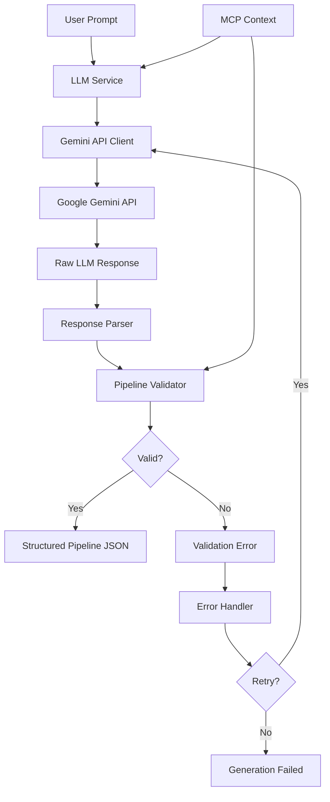
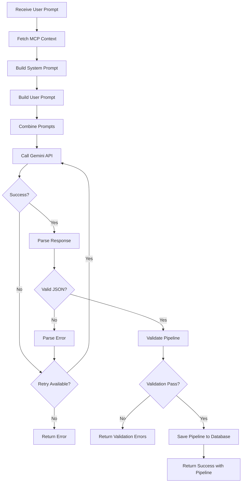
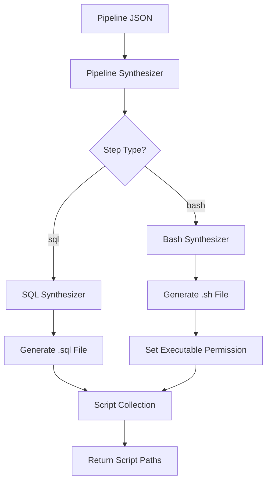
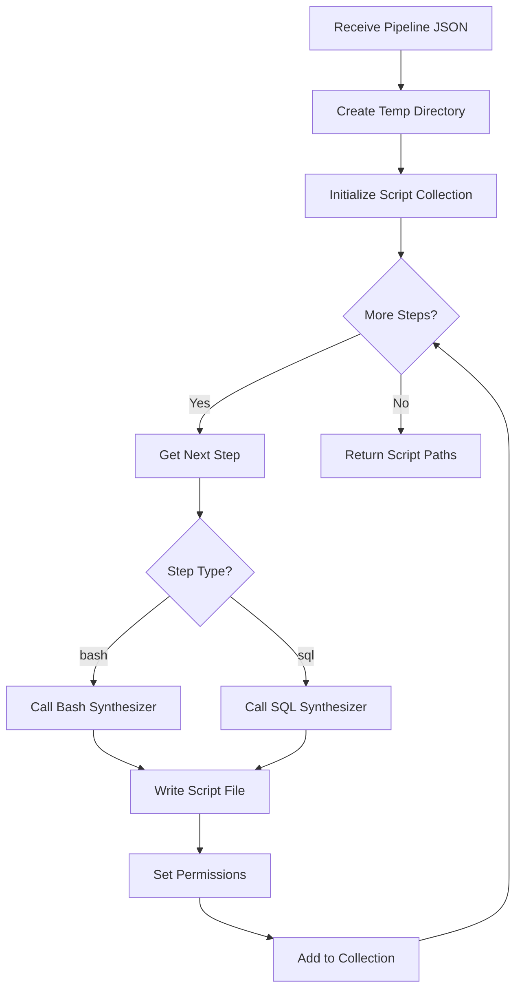
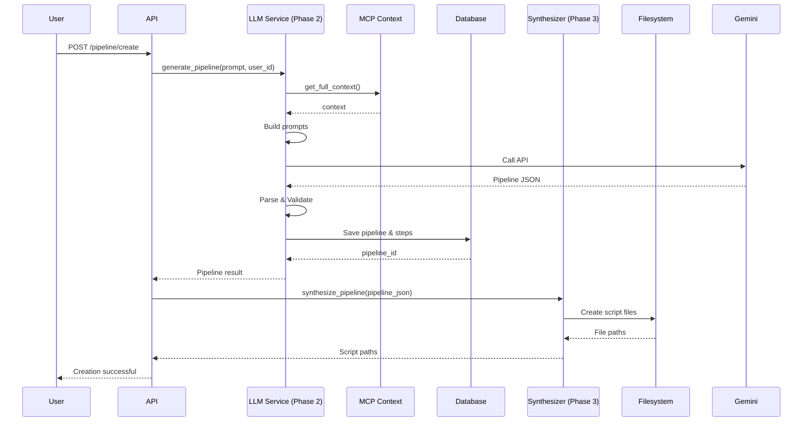

# QueryForge Phase 2 & 3 Design Document

**Project:** QueryForge - Automated Data Pipeline Generation System  
**Phases:** Phase 2 (LLM Pipeline Generator) & Phase 3 (Bash/SQL Synthesizer)  
**Version:** 1.0  
**Status:** Design Ready for Development

---

## 1. Overview

This document provides the strategic design for implementing Phase 2 (LLM Pipeline Generator) and Phase 3 (Bash/SQL Synthesizer) of the QueryForge system. These phases transform natural language user requests into executable pipeline scripts through AI-powered generation and structured synthesis.

### 1.1 Phase 2 Purpose

The LLM Pipeline Generator accepts natural language prompts and leverages the MCP context (completed in Phase 1) to generate validated, structured pipeline definitions using the Google Gemini API. It ensures all generated steps reference only existing database tables and filesystem resources.

### 1.2 Phase 3 Purpose

The Bash/SQL Synthesizer converts the structured JSON pipeline output from Phase 2 into individual executable script files with proper permissions, error handling, and logging capabilities for sandbox execution.

### 1.3 Dependencies

**Phase 2 Dependencies:**
- Phase 0: Project setup, database schema, configuration management
- Phase 1: MCP Context Manager providing database and filesystem metadata

**Phase 3 Dependencies:**
- Phase 0: Project setup
- Phase 2: LLM Pipeline Generator output format

---

## 2. Phase 2: LLM Pipeline Generator Design

### 2.1 Objectives

1. Integrate Google Gemini API for natural language processing
2. Generate structured pipeline definitions from user prompts
3. Validate all generated references against MCP context
4. Ensure output follows strict JSON format specification
5. Implement robust error handling and retry mechanisms
6. Meet performance requirement of less than 3 seconds for generation

### 2.2 System Architecture



### 2.3 Core Components

#### 2.3.1 Gemini API Client

**Responsibility:** Manage communication with Google Gemini API

**Key Behaviors:**
- Authenticate using API key from configuration
- Send prompt with context to Gemini API
- Implement automatic retry logic for transient failures
- Handle timeout scenarios (3 second maximum)
- Manage API rate limiting
- Log all API interactions

**Configuration Parameters:**
| Parameter | Type | Default | Description |
|-----------|------|---------|-------------|
| api_key | string | from .env | Gemini API authentication key |
| model_name | string | gemini-pro | Gemini model version to use |
| timeout_seconds | integer | 3 | Maximum wait time for API response |
| max_retries | integer | 2 | Number of retry attempts for failures |
| retry_delay_seconds | float | 0.5 | Delay between retry attempts |

**Error Handling Strategy:**
- Network errors: Retry up to max_retries
- Timeout errors: Fail immediately, return timeout error
- Authentication errors: Fail immediately, no retry
- Rate limit errors: Exponential backoff retry
- Malformed response: Parse error handling

#### 2.3.2 Prompt Engineering Module

**Responsibility:** Construct optimized prompts for Gemini API

**System Prompt Structure:**

The system prompt establishes the AI's role and constraints. It must include:

1. **Role Definition:** Define AI as expert pipeline generator
2. **Context Inclusion:** Embed complete MCP metadata (database schema + filesystem)
3. **Output Format Specification:** Mandate strict JSON structure
4. **Constraint Declaration:** 
   - Only reference existing tables and files from context
   - Use only whitelisted Bash commands
   - Follow SQL best practices
   - Ensure proper step ordering
5. **Safety Guidelines:**
   - No destructive operations without explicit user intent
   - Validate data types and constraints
   - Include error handling in generated steps

**User Prompt Template:**

Combines user's natural language request with context references:

```
Task: {user_prompt}

Available Resources:
Database Tables: {table_list}
Available Files: {file_list}

Generate a pipeline to complete this task.
```

**Prompt Construction Parameters:**

| Element | Source | Purpose |
|---------|--------|---------|
| Database Schema | MCP Context | Inform AI of available tables and columns |
| File Metadata | MCP Context | Inform AI of available files and structures |
| Bash Whitelist | Configuration | Restrict to allowed commands |
| User Request | API Input | Task to accomplish |
| Output Format | Fixed Template | Ensure consistent JSON structure |

#### 2.3.3 Response Parser

**Responsibility:** Extract and validate JSON from Gemini API response

**Parsing Strategy:**

1. **Extract JSON Block:** Locate JSON content in response text
2. **Parse JSON Structure:** Convert text to structured data
3. **Schema Validation:** Verify all required fields present
4. **Type Checking:** Ensure field types match specification

**Expected Input Format (from Gemini):**

```json
{
  "pipeline": [
    {
      "step_number": 1,
      "type": "bash",
      "content": "command with arguments",
      "description": "human-readable step purpose"
    },
    {
      "step_number": 2,
      "type": "sql",
      "content": "SQL statement",
      "description": "human-readable step purpose"
    }
  ]
}
```

**Required Field Validation:**

| Field | Required | Type | Constraints |
|-------|----------|------|-------------|
| pipeline | Yes | array | Must contain at least 1 step |
| step_number | Yes | integer | Sequential starting from 1 |
| type | Yes | string | Must be 'bash' or 'sql' |
| content | Yes | string | Non-empty script content |
| description | No | string | Optional explanation |

**Error Scenarios:**
- Missing required fields: Reject with detailed error
- Invalid step numbers: Reject (must be sequential)
- Empty pipeline: Reject
- Unknown step type: Reject
- Malformed JSON: Attempt cleanup, then reject if fails

#### 2.3.4 Pipeline Validator

**Responsibility:** Validate generated pipeline against MCP context and safety rules

**Validation Checks:**

1. **Database Reference Validation**
   - Extract all table names referenced in SQL steps
   - Verify each table exists in MCP database context
   - Extract all column names referenced
   - Verify columns exist in respective tables
   - Check data type compatibility for operations

2. **Filesystem Reference Validation**
   - Extract all file paths referenced in Bash steps
   - Verify each file exists in MCP filesystem context
   - Validate file types match expected operations (e.g., CSV for CSV parsing)

3. **Bash Command Validation**
   - Parse Bash step content to extract primary command
   - Check command against whitelist from configuration
   - Reject steps using prohibited commands
   - Validate command syntax (basic structural check)

4. **SQL Safety Validation**
   - Detect destructive operations (DROP, DELETE without WHERE, TRUNCATE)
   - Flag for user confirmation if destructive
   - Ensure parameterized queries where applicable
   - Validate SQL syntax structure

5. **Execution Order Validation**
   - Verify steps are properly sequenced
   - Check dependencies (e.g., table creation before insertion)
   - Validate file operations precede database imports

6. **Resource Constraint Validation**
   - Verify operations stay within sandbox boundaries
   - Check file paths use only allowed directories
   - Ensure no system-level operations

**Validation Output:**

```
{
  "is_valid": boolean,
  "errors": [
    {
      "step_number": integer,
      "error_type": string,
      "message": string,
      "suggestion": string
    }
  ],
  "warnings": [
    {
      "step_number": integer,
      "warning_type": string,
      "message": string
    }
  ]
}
```

#### 2.3.5 LLM Pipeline Service

**Responsibility:** Orchestrate the complete pipeline generation workflow

**Main Workflow:**



**Method Specification:**

**generate_pipeline(user_prompt, user_id, mcp_context)**

Input Parameters:
- user_prompt: Natural language task description
- user_id: Identifier for user creating pipeline
- mcp_context: Complete MCP metadata (optional, fetched if not provided)

Output:
- Success: Structured pipeline JSON with pipeline_id
- Failure: Error object with type and message

Side Effects:
- Creates record in Pipelines table
- Creates records in Pipeline_Steps table
- Creates record in Schema_Snapshots table (MCP context snapshot)

Performance Targets:
- Total execution time: Less than 3 seconds (95th percentile)
- API call time: Less than 2 seconds
- Validation time: Less than 500 milliseconds

### 2.4 Database Interactions

#### 2.4.1 Pipeline Storage

**Pipelines Table Insert:**

When pipeline generation succeeds:
- Insert new record with status 'pending'
- Store user_id and prompt_text
- Capture created_at timestamp

**Pipeline_Steps Table Insert:**

For each step in generated pipeline:
- Insert step with pipeline_id reference
- Store step_number, code_type, script_content
- Maintain sequential step_number order

**Schema_Snapshots Table Insert:**

Store MCP context used for generation:
- Link to pipeline_id
- Store complete database structure as JSON
- Store complete file list as JSON
- Record snapshot_time

### 2.5 Error Handling Strategy

**Error Categories:**

| Error Type | Handling Strategy | User Impact |
|------------|------------------|-------------|
| API Timeout | Retry once, then fail | Error message with retry option |
| API Authentication | Fail immediately | Configuration error message |
| Network Error | Retry with backoff | Temporary failure message |
| Malformed Response | Log and fail | Generation error message |
| Validation Failure | Return detailed errors | Specific validation feedback |
| Database Error | Rollback, fail | System error message |

**Error Response Format:**

```
{
  "success": false,
  "error_type": "validation_error",
  "message": "Pipeline validation failed",
  "details": {
    "step_errors": [...],
    "suggestion": "Check that all referenced tables exist"
  },
  "retry_possible": true
}
```

### 2.6 Configuration Requirements

**.env Configuration:**

```
GEMINI_API_KEY=your_api_key_here
GEMINI_MODEL=gemini-pro
GEMINI_TIMEOUT_SECONDS=3
GEMINI_MAX_RETRIES=2
```

**Settings Extension:**

Add to existing Settings class:
- GEMINI_MODEL: string (default: "gemini-pro")
- GEMINI_TIMEOUT_SECONDS: integer (default: 3)
- GEMINI_MAX_RETRIES: integer (default: 2)

---

## 3. Phase 3: Bash/SQL Synthesizer Design

### 3.1 Objectives

1. Convert structured JSON pipeline to executable script files
2. Generate properly formatted Bash scripts with error handling
3. Generate properly formatted SQL scripts with transactions
4. Set correct file permissions for executability
5. Organize scripts in temporary execution directory
6. Enable sequential execution by sandbox runner

### 3.2 System Architecture



### 3.3 Core Components

#### 3.3.1 Bash Script Synthesizer

**Responsibility:** Generate executable Bash scripts from pipeline steps

**Script Template Structure:**

Each generated Bash script must include:

1. **Shebang Line:** Specify interpreter
2. **Error Handling:** Enable strict error mode
3. **Logging Setup:** Output execution information
4. **Main Script Content:** User's pipeline logic
5. **Exit Code:** Proper success/failure indication

**Template Format:**

```
#!/bin/bash
set -e  # Exit on error
set -u  # Exit on undefined variable
set -o pipefail  # Catch errors in pipes

# Script metadata
SCRIPT_NAME="step_{step_number}.sh"
STEP_NUMBER={step_number}
START_TIME=$(date +%s)

# Logging function
log_info() {
    echo "[INFO] [Step $STEP_NUMBER] $1"
}

log_error() {
    echo "[ERROR] [Step $STEP_NUMBER] $1" >&2
}

# Execute main content
log_info "Starting execution"

{script_content}

# Calculate execution time
END_TIME=$(date +%s)
DURATION=$((END_TIME - START_TIME))
log_info "Completed in ${DURATION}s"

exit 0
```

**Script Generation Rules:**

1. **Command Validation:** Verify first command token is whitelisted
2. **Path Sanitization:** Ensure paths are sandbox-safe
3. **Variable Expansion Safety:** Escape special characters appropriately
4. **Output Redirection:** Preserve user's redirection operators
5. **Pipe Handling:** Maintain pipe chains correctly

**Error Handling Mechanisms:**

- set -e: Automatic exit on command failure
- set -u: Prevent undefined variable usage
- set -o pipefail: Detect failures in pipeline chains
- Trap handlers for cleanup (optional enhancement)

**File Permissions:**

Generated scripts must have:
- Owner: read, write, execute (7)
- Group: read, execute (5)
- Other: read, execute (5)
- Octal: 0755

#### 3.3.2 SQL Script Synthesizer

**Responsibility:** Generate executable SQL scripts from pipeline steps

**Script Template Structure:**

Each generated SQL script must include:

1. **Transaction Wrapper:** BEGIN/COMMIT/ROLLBACK
2. **Error Handling:** ON ERROR behavior
3. **Metadata Comments:** Step information
4. **Main SQL Content:** User's SQL operations
5. **Execution Logging:** Track operation completion

**Template Format:**

```
-- QueryForge Pipeline Step {step_number}
-- Generated: {timestamp}
-- Description: {description}

-- Enable error reporting
.mode list
.headers on

-- Begin transaction
BEGIN TRANSACTION;

-- Main SQL content
{script_content}

-- Commit transaction
COMMIT;

-- Log completion
SELECT 'Step {step_number} completed successfully' as status;
```

**SQL Generation Rules:**

1. **Statement Separation:** Ensure proper semicolon placement
2. **Transaction Boundaries:** Wrap all operations
3. **Foreign Key Handling:** Respect constraints
4. **Data Type Validation:** Match column types
5. **Identifier Quoting:** Properly quote table/column names if needed

**Transaction Strategy:**

- BEGIN TRANSACTION at start
- COMMIT on successful completion
- ROLLBACK on any error (handled by SQLite)
- Atomic execution of all statements

**Error Handling:**

SQLite automatically rolls back transactions on error. Additional logging can track which statement failed.

#### 3.3.3 Pipeline Synthesizer Service

**Responsibility:** Orchestrate conversion of complete pipeline to script files

**Main Workflow:**



**Method Specification:**

**synthesize_pipeline(pipeline_json, output_directory)**

Input Parameters:
- pipeline_json: Structured pipeline from Phase 2
- output_directory: Target directory for script files (default: temp directory)

Output:
- List of script file paths in execution order
- Metadata about generated scripts

Side Effects:
- Creates script files on filesystem
- Sets file permissions
- Creates output directory if not exists

File Naming Convention:
- Pattern: step_{number}_{type}.{extension}
- Examples: step_1_bash.sh, step_2_sql.sql, step_3_bash.sh

**Directory Structure:**

```
{output_directory}/
├── pipeline_{id}/
│   ├── step_1_bash.sh
│   ├── step_2_sql.sql
│   ├── step_3_bash.sh
│   └── manifest.json
```

**Manifest File:**

Track synthesized scripts for execution tracking:

```json
{
  "pipeline_id": 42,
  "generated_at": "2025-01-15T10:30:00Z",
  "scripts": [
    {
      "step_number": 1,
      "type": "bash",
      "path": "step_1_bash.sh",
      "size_bytes": 256
    },
    {
      "step_number": 2,
      "type": "sql",
      "path": "step_2_sql.sql",
      "size_bytes": 512
    }
  ]
}
```

#### 3.3.4 Script Validation

**Responsibility:** Verify generated scripts before execution

**Validation Checks:**

1. **File Existence:** Confirm all script files created
2. **File Permissions:** Verify executable flags set correctly
3. **Syntax Validation:**
   - Bash: Run bash -n (syntax check only)
   - SQL: Basic structure validation
4. **Size Validation:** Ensure non-empty files
5. **Encoding Validation:** Confirm UTF-8 encoding

**Validation Output:**

```
{
  "is_valid": boolean,
  "script_count": integer,
  "total_size_bytes": integer,
  "issues": [
    {
      "script": "step_1_bash.sh",
      "issue_type": "permission_error",
      "message": "Script not executable"
    }
  ]
}
```

### 3.4 Filesystem Operations

**Directory Management:**

- Create unique directory per pipeline using pipeline_id
- Use temporary directory structure for sandbox isolation
- Clean up directories after execution (Phase 4 responsibility)

**Path Handling:**

- Always use absolute paths for script generation
- Normalize path separators for cross-platform compatibility
- Validate paths stay within sandbox boundaries

**Temporary File Strategy:**

- Use system temp directory as base
- Create subdirectory: {TEMP}/queryforge_pipelines/pipeline_{id}/
- Include timestamp in directory name for uniqueness
- Prevent collision with concurrent pipeline generations

### 3.5 Error Handling Strategy

**Error Categories:**

| Error Type | Handling Strategy | Impact |
|------------|------------------|--------|
| Directory Creation Failure | Retry once, then fail | Cannot synthesize pipeline |
| File Write Error | Fail immediately | Synthesis incomplete |
| Permission Setting Error | Log warning, continue | May fail at execution |
| Syntax Validation Error | Fail synthesis | Invalid script generated |
| Invalid Step Type | Reject step | Pipeline incomplete |

**Error Response Format:**

```
{
  "success": false,
  "error_type": "synthesis_error",
  "message": "Failed to synthesize pipeline",
  "failed_step": 2,
  "details": {
    "reason": "File write permission denied",
    "path": "/tmp/queryforge_pipelines/pipeline_42/step_2_sql.sql"
  }
}
```

### 3.6 Configuration Requirements

**Settings Extension:**

Add to existing Settings class:
- SYNTHESIZER_OUTPUT_DIR: string (default: "/tmp/queryforge_pipelines")
- SCRIPT_FILE_PERMISSIONS: string (default: "0755")
- ENABLE_SYNTAX_VALIDATION: boolean (default: true)

---

## 4. Integration Between Phase 2 and Phase 3

### 4.1 Data Flow



### 4.2 Interface Contract

**Phase 2 Output → Phase 3 Input:**

Phase 2 must provide to Phase 3:

```
{
  "pipeline_id": integer,
  "user_id": integer,
  "prompt_text": string,
  "status": "pending",
  "created_at": timestamp,
  "steps": [
    {
      "id": integer,
      "step_number": integer,
      "code_type": "bash" | "sql",
      "script_content": string
    }
  ]
}
```

**Phase 3 Output → Phase 4 (Future):**

Phase 3 provides to sandbox execution:

```
{
  "pipeline_id": integer,
  "output_directory": string,
  "scripts": [
    {
      "step_number": integer,
      "type": "bash" | "sql",
      "path": string (absolute),
      "executable": boolean
    }
  ]
}
```

### 4.3 Shared Data Models

**Pipeline Step Schema:**

Both phases must agree on structure:

| Field | Type | Source | Usage |
|-------|------|--------|-------|
| step_number | integer | Phase 2 | Execution order |
| code_type | string | Phase 2 | Determines synthesizer |
| script_content | text | Phase 2 | Script body |
| path | string | Phase 3 | Execution location |

---

## 5. Testing Strategy

### 5.1 Phase 2 Testing

**Unit Tests:**

1. **Gemini Client Tests:**
   - Test API authentication
   - Test successful response handling
   - Test timeout scenarios
   - Test retry logic
   - Test rate limiting

2. **Prompt Builder Tests:**
   - Test system prompt construction
   - Test user prompt formatting
   - Test context embedding
   - Test command whitelist inclusion

3. **Response Parser Tests:**
   - Test valid JSON parsing
   - Test malformed JSON handling
   - Test missing field detection
   - Test type validation

4. **Pipeline Validator Tests:**
   - Test table existence checking
   - Test file existence checking
   - Test Bash command validation
   - Test SQL syntax validation
   - Test sequential step validation

**Integration Tests:**

1. **Simple Request Test:**
   - Prompt: "Import sales.csv into orders table"
   - Verify valid pipeline generated
   - Verify all references valid

2. **Complex Request Test:**
   - Prompt: "Filter CSV, transform with awk, import to database"
   - Verify multi-step pipeline
   - Verify proper step ordering

3. **Error Case Tests:**
   - Non-existent file reference
   - Non-existent table reference
   - Invalid Bash command usage
   - Malformed LLM response

4. **End-to-End Test:**
   - Complete flow from prompt to database storage
   - Verify Pipeline, Pipeline_Steps, Schema_Snapshots created

### 5.2 Phase 3 Testing

**Unit Tests:**

1. **Bash Synthesizer Tests:**
   - Test script template generation
   - Test shebang inclusion
   - Test error handling code
   - Test logging inclusion
   - Test permission setting

2. **SQL Synthesizer Tests:**
   - Test transaction wrapper
   - Test comment inclusion
   - Test statement formatting
   - Test error handling

3. **Pipeline Synthesizer Tests:**
   - Test directory creation
   - Test file naming
   - Test manifest generation
   - Test mixed bash/sql pipelines

**Integration Tests:**

1. **Single Step Test:**
   - Generate single Bash script
   - Verify file created
   - Verify permissions correct
   - Verify syntax valid

2. **Multi-Step Test:**
   - Generate 5-step pipeline
   - Verify all files created
   - Verify sequential naming
   - Verify manifest accuracy

3. **Error Handling Test:**
   - Test directory creation failure
   - Test file write failure
   - Test permission failure

4. **Syntax Validation Test:**
   - Generate scripts with syntax errors
   - Verify detection before execution

### 5.3 Integration Testing (Phase 2 + 3)

**Complete Flow Tests:**

1. **CSV Import Pipeline:**
   - User prompt: "Import inventory.json into products table"
   - Verify LLM generates appropriate steps
   - Verify synthesizer creates valid scripts
   - Verify scripts are syntactically correct

2. **Multi-Step Transformation:**
   - User prompt: "Clean sales data and load into database"
   - Verify multiple Bash steps for cleaning
   - Verify SQL step for loading
   - Verify proper execution order

3. **Error Scenario:**
   - User prompt references non-existent file
   - Verify Phase 2 validation catches error
   - Verify clear error message returned
   - Verify no synthesis attempted

---

## 6. Performance Requirements

### 6.1 Phase 2 Performance Targets

| Metric | Target | Measurement Point |
|--------|--------|------------------|
| Total generation time | < 3 seconds | User request to pipeline saved |
| Gemini API call | < 2 seconds | API invocation to response |
| Response parsing | < 100 milliseconds | JSON extraction and validation |
| Pipeline validation | < 500 milliseconds | All validation checks |
| Database storage | < 400 milliseconds | Save pipeline and steps |

### 6.2 Phase 3 Performance Targets

| Metric | Target | Measurement Point |
|--------|--------|------------------|
| Total synthesis time | < 1 second | JSON input to scripts ready |
| Per-script generation | < 100 milliseconds | Individual script creation |
| Permission setting | < 50 milliseconds | All scripts |
| Syntax validation | < 200 milliseconds | All scripts |

### 6.3 Scalability Considerations

**Phase 2:**
- Gemini API supports concurrent requests
- Cache MCP context to reduce overhead
- Connection pooling for database operations

**Phase 3:**
- Filesystem operations are fast for small files
- Parallel script generation possible (future enhancement)
- Temporary directory cleanup should be async

---

## 7. Security Considerations

### 7.1 Phase 2 Security

**API Key Protection:**
- Store Gemini API key in environment variables only
- Never log or expose API key in responses
- Rotate keys periodically

**Prompt Injection Prevention:**
- Sanitize user prompts before sending to Gemini
- Validate LLM responses against strict schema
- Reject responses with unexpected content

**Resource Reference Validation:**
- Always validate against MCP context
- Prevent path traversal in file references
- Prevent SQL injection in generated queries

**Command Whitelist Enforcement:**
- Strictly validate Bash commands against whitelist
- Reject any prohibited commands
- Log validation failures for security monitoring

### 7.2 Phase 3 Security

**Script Content Sanitization:**
- Escape special characters in script content
- Prevent command injection in generated scripts
- Validate no system-level operations included

**Filesystem Isolation:**
- Restrict script output to designated directories
- Prevent writing outside sandbox boundaries
- Validate all paths before file creation

**Permission Management:**
- Set minimal required permissions on scripts
- Prevent privilege escalation opportunities
- Track all file creation operations

**Execution Safety:**
- Scripts should not modify synthesizer code
- Prevent recursive script execution
- Isolate script environment from system

---

## 8. Monitoring and Logging

### 8.1 Phase 2 Logging

**Critical Log Points:**

1. **API Interactions:**
   - Log all Gemini API requests (excluding API key)
   - Log response times
   - Log retry attempts
   - Log failures with error details

2. **Validation Events:**
   - Log validation failures with step details
   - Log rejected table/file references
   - Log prohibited command usage

3. **Performance Metrics:**
   - Log generation times
   - Log parsing times
   - Log database operation times

**Log Format:**

```
[timestamp] [level] [component] [pipeline_id] message {context}
```

Example:
```
[2025-01-15T10:30:15Z] [INFO] [LLMService] [pipeline_42] Generated pipeline with 3 steps in 2.1s
[2025-01-15T10:30:16Z] [ERROR] [Validator] [pipeline_42] Validation failed: Table 'nonexistent' not found in context
```

### 8.2 Phase 3 Logging

**Critical Log Points:**

1. **Synthesis Operations:**
   - Log script file creation
   - Log permission setting
   - Log directory creation

2. **Validation Events:**
   - Log syntax validation results
   - Log permission verification
   - Log file size checks

3. **Error Conditions:**
   - Log file write failures
   - Log permission setting failures
   - Log directory creation failures

**Metrics to Track:**

- Scripts generated per hour
- Average synthesis time
- Failure rate by error type
- File size distribution

---

## 9. Failure Recovery

### 9.1 Phase 2 Failure Scenarios

**Scenario: Gemini API Timeout**
- Recovery: Retry request once
- If retry fails: Return timeout error to user
- User action: Can retry entire request

**Scenario: Validation Failure**
- Recovery: Return detailed validation errors
- No retry (deterministic failure)
- User action: Modify prompt and retry

**Scenario: Database Save Failure**
- Recovery: Rollback transaction
- Log error for investigation
- User action: Retry request after system check

### 9.2 Phase 3 Failure Scenarios

**Scenario: Directory Creation Failure**
- Recovery: Retry once with alternative path
- If retry fails: Return error, abort synthesis
- User action: Check disk space, retry

**Scenario: File Write Failure**
- Recovery: Delete partial scripts, abort synthesis
- Clean up created files
- User action: Retry after resolving filesystem issue

**Scenario: Permission Setting Failure**
- Recovery: Log warning, continue synthesis
- Scripts may fail at execution
- User action: Manual permission fix or retry

---

## 10. Future Enhancements

### 10.1 Phase 2 Enhancements

1. **Multi-Model Support:**
   - Allow selection of different LLM providers
   - Compare output quality across models
   - Fallback to alternative model on primary failure

2. **Prompt Optimization:**
   - A/B test different prompt templates
   - Machine learning-based prompt refinement
   - User feedback integration for prompt improvement

3. **Advanced Validation:**
   - Static analysis of generated SQL
   - Data flow analysis across steps
   - Performance estimation for pipelines

4. **Caching Strategy:**
   - Cache similar prompt responses
   - Deduplicate common pipeline patterns
   - Reduce API costs through intelligent caching

### 10.2 Phase 3 Enhancements

1. **Parallel Synthesis:**
   - Generate multiple scripts concurrently
   - Reduce synthesis time for large pipelines

2. **Script Optimization:**
   - Combine sequential Bash commands
   - Optimize SQL queries
   - Reduce intermediate file operations

3. **Advanced Validation:**
   - Deep syntax checking with shellcheck
   - SQL query optimization analysis
   - Security vulnerability scanning

4. **Template Customization:**
   - User-defined script templates
   - Organization-specific standards enforcement
   - Custom logging formats

---

## 11. Dependencies and Prerequisites

### 11.1 External Dependencies

**Phase 2:**
- google-generativeai: Gemini API client library
- pydantic: Data validation
- aiohttp: Async HTTP client (if using async Gemini calls)

**Phase 3:**
- os: Filesystem operations
- pathlib: Path manipulation
- subprocess: Syntax validation (bash -n)
- stat: Permission management

### 11.2 Internal Dependencies

**Phase 2:**
- app.core.config: Configuration management
- app.core.database: Database operations
- app.services.mcp: MCP context manager

**Phase 3:**
- app.core.config: Configuration management
- app.core.database: Pipeline retrieval

### 11.3 Configuration Prerequisites

**Required .env Variables:**
```
GEMINI_API_KEY=your_api_key_here
DATA_DIRECTORY=./data
SANDBOX_DIRECTORY=./sandbox
ALLOWED_BASH_COMMANDS=awk,sed,cp,mv,curl,cat,grep,cut,sort,uniq
```

---

## 12. Success Criteria

### 12.1 Phase 2 Completion Criteria

- [ ] Gemini API integration functional with authentication
- [ ] System and user prompts properly constructed with MCP context
- [ ] LLM responses parsed into valid JSON structure
- [ ] Pipeline validation rejects non-existent resources
- [ ] Bash command whitelist enforced
- [ ] SQL syntax validation implemented
- [ ] Pipeline and steps saved to database correctly
- [ ] Schema snapshots captured
- [ ] Error handling covers all failure scenarios
- [ ] Performance target of < 3 seconds met
- [ ] Unit test coverage > 80%
- [ ] Integration tests pass for common scenarios

### 12.2 Phase 3 Completion Criteria

- [ ] Bash script synthesis generates valid .sh files
- [ ] SQL script synthesis generates valid .sql files
- [ ] Script templates include error handling
- [ ] Script templates include logging
- [ ] File permissions set correctly (0755 for .sh)
- [ ] Directory structure created properly
- [ ] Manifest file generated accurately
- [ ] Syntax validation detects malformed scripts
- [ ] Mixed bash/sql pipelines synthesized correctly
- [ ] Performance target of < 1 second met
- [ ] Unit test coverage > 80%
- [ ] Integration tests pass for multi-step pipelines

### 12.3 Combined Integration Criteria

- [ ] End-to-end flow from prompt to executable scripts works
- [ ] Generated scripts are syntactically valid
- [ ] All file references point to actual MCP-discovered files
- [ ] All table references point to actual MCP-discovered tables
- [ ] Scripts ready for Phase 4 sandbox execution
- [ ] Complete audit trail in database
- [ ] Error messages clear and actionable

---

## 13. Acceptance Test Scenarios

### 13.1 Scenario: Simple CSV Import

**User Prompt:**
"Import inventory.json into products table"

**Expected Phase 2 Output:**
```json
{
  "pipeline_id": 101,
  "steps": [
    {
      "step_number": 1,
      "type": "bash",
      "content": "cat data/inventory.json | jq -r '.[] | [.id, .name, .price] | @csv' > /tmp/products_import.csv"
    },
    {
      "step_number": 2,
      "type": "sql",
      "content": "COPY products FROM '/tmp/products_import.csv' WITH (FORMAT csv)"
    }
  ]
}
```

**Expected Phase 3 Output:**
- File: step_1_bash.sh (executable, with error handling)
- File: step_2_sql.sql (with transaction wrapper)
- Manifest: manifest.json (lists both files)

**Validation:**
- inventory.json exists in MCP filesystem context
- products table exists in MCP database context
- jq command validated (or substituted with Python)
- All file paths absolute

### 13.2 Scenario: Multi-Step Transformation

**User Prompt:**
"Clean sales.csv by removing rows with empty amounts, then import to orders table"

**Expected Phase 2 Output:**
```json
{
  "pipeline_id": 102,
  "steps": [
    {
      "step_number": 1,
      "type": "bash",
      "content": "awk -F',' '$3!=\"\" {print}' data/sales.csv > /tmp/cleaned_sales.csv"
    },
    {
      "step_number": 2,
      "type": "sql",
      "content": "COPY orders FROM '/tmp/cleaned_sales.csv' WITH (FORMAT csv, HEADER true)"
    }
  ]
}
```

**Expected Phase 3 Output:**
- File: step_1_bash.sh (awk command wrapped with error handling)
- File: step_2_sql.sql (COPY wrapped in transaction)
- Both scripts executable and valid

**Validation:**
- sales.csv exists in MCP context
- orders table exists in MCP context
- awk is whitelisted command
- Intermediate file path in /tmp

### 13.3 Scenario: Validation Failure

**User Prompt:**
"Import missing_file.csv into orders table"

**Expected Phase 2 Output:**
```json
{
  "success": false,
  "error_type": "validation_error",
  "message": "Pipeline validation failed",
  "details": {
    "errors": [
      {
        "step_number": 1,
        "error_type": "file_not_found",
        "message": "File 'missing_file.csv' not found in filesystem context",
        "available_files": ["inventory.json", "sales.csv"]
      }
    ]
  }
}
```

**Expected Phase 3 Output:**
- No synthesis attempted (Phase 2 failed)

**Validation:**
- Error detected before synthesis
- Clear error message provided
- Available files listed for user

---

## 14. Implementation Roadmap

### 14.1 Phase 2 Implementation Order

1. **Week 1: Foundation**
   - Set up Gemini API client with authentication
   - Implement basic prompt construction
   - Test API connectivity

2. **Week 1-2: Core Generation**
   - Implement response parsing
   - Build pipeline validator
   - Integrate with MCP context

3. **Week 2: Database Integration**
   - Implement pipeline storage logic
   - Create schema snapshot functionality
   - Add error handling and logging

4. **Week 2: Testing**
   - Write unit tests for all components
   - Create integration tests
   - Performance testing and optimization

### 14.2 Phase 3 Implementation Order

1. **Week 1: Bash Synthesizer**
   - Create Bash script template
   - Implement script generation logic
   - Add permission setting

2. **Week 1: SQL Synthesizer**
   - Create SQL script template
   - Implement SQL generation logic
   - Add transaction wrappers

3. **Week 1-2: Pipeline Orchestration**
   - Build pipeline synthesizer service
   - Implement directory management
   - Create manifest generation

4. **Week 2: Validation & Testing**
   - Add syntax validation
   - Write unit tests
   - Create integration tests
   - Test with Phase 2 output

### 14.3 Timeline Summary

**Phase 2:** 2-3 weeks
**Phase 3:** 1-2 weeks
**Integration Testing:** 2-3 days
**Total Estimated Duration:** 3-5 weeks
