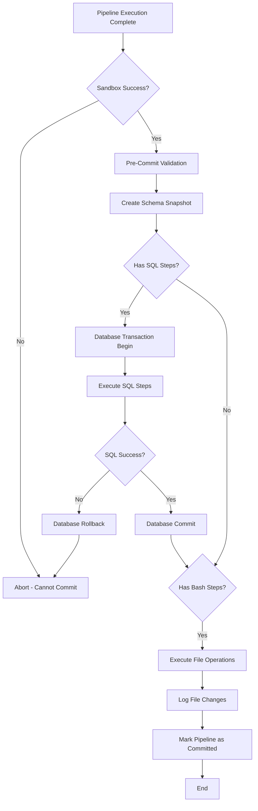
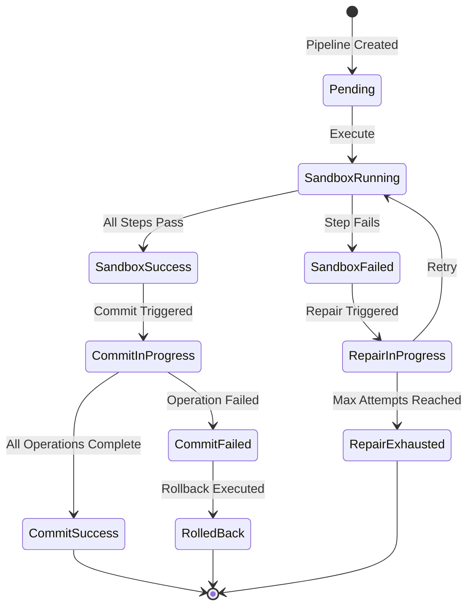
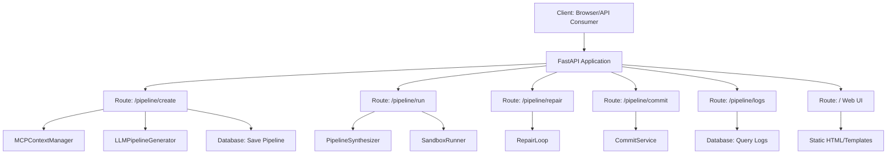
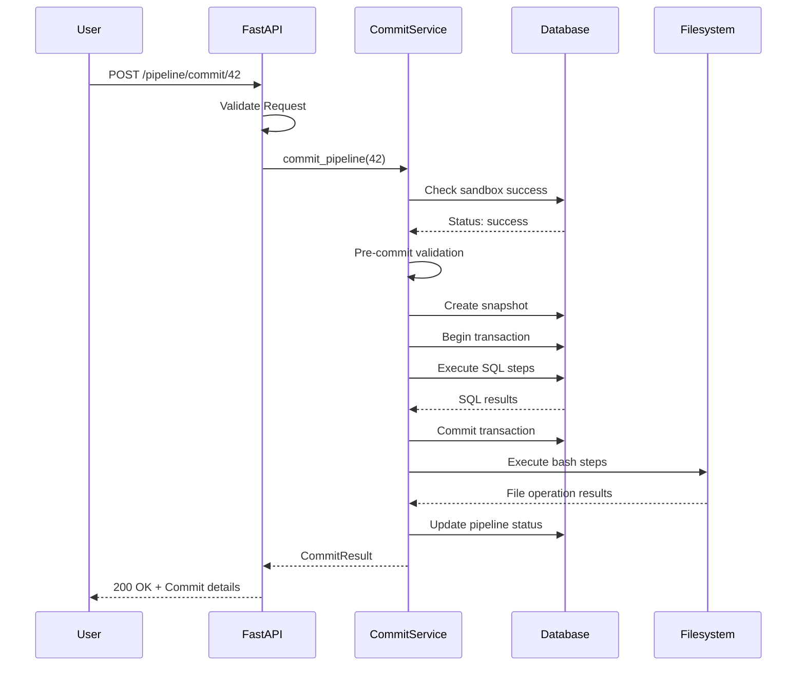
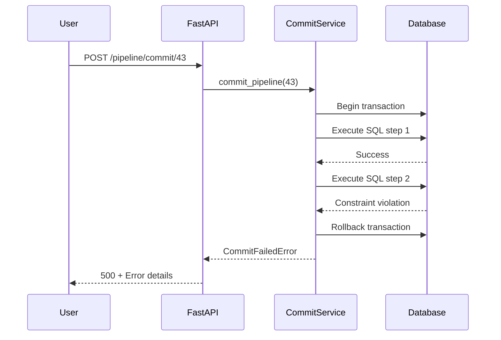

# Phase 6 & 7 Design Document

**Project:** QueryForge - Automated Data Pipeline Generation System  
**Phases:** Phase 6 (Commit Module) + Phase 7 (FastAPI Integration + Web UI)  
**Dependencies:** Phase 0-5 (Complete)  
**Document Version:** 1.0  
**Created:** 2025-11-27

---

## Executive Summary

This design document specifies the implementation strategy for Phase 6 (Commit Module) and Phase 7 (FastAPI Integration + Web UI) of QueryForge. These phases transform the current sandbox-based execution system into a production-ready application with:

- Safe production deployment of validated pipelines
- Transactional database commits with rollback capability
- RESTful API for pipeline lifecycle management
- Minimal web interface for end-user interaction

**Design Principle:** Progressive enhancement from sandbox validation to production execution with comprehensive audit trails and rollback mechanisms.

---

## Phase 6: Commit Module

### Overview

The Commit Module bridges the gap between sandbox validation and production deployment. After a pipeline successfully executes in the sandbox environment, this module safely applies the validated operations to the real database and filesystem.

**Core Responsibility:** Execute validated pipeline steps on production resources with transactional safety and full rollback capability.

### Strategic Goals

| Goal | Rationale |
|------|-----------|
| Transactional Integrity | All database operations must be atomic - either fully committed or fully rolled back |
| Audit Trail | Every production change must be traceable with before/after snapshots |
| Safety-First | Only pipelines with successful sandbox execution may proceed to commit |
| Filesystem Reversibility | File operations must be logged to enable potential rollback |

---

### Architecture

#### Component Structure



#### Service Responsibilities

| Service Component | Responsibility |
|------------------|----------------|
| CommitService | Orchestrates commit workflow and validation |
| DatabaseCommitter | Handles transactional SQL execution |
| FilesystemCommitter | Executes bash operations with change logging |
| SnapshotManager | Captures before/after database state |
| ValidationEngine | Pre-commit safety checks |

---

### Detailed Component Design

#### 1. CommitService (Orchestrator)

**Purpose:** Central coordinator for the commit process with validation gates.

**Core Methods:**

| Method | Input | Output | Description |
|--------|-------|--------|-------------|
| commit_pipeline | pipeline_id | CommitResult | Main entry point for production deployment |
| validate_for_commit | pipeline_id | ValidationReport | Pre-commit safety checks |
| rollback_commit | pipeline_id | RollbackResult | Reverses a committed pipeline if needed |

**Validation Rules:**

The service must verify the following conditions before allowing commit:

- Pipeline status is "sandbox_success" or "repaired_success"
- Latest execution log shows is_successful = true
- No pending repair attempts
- All referenced database tables exist in current schema
- All referenced files exist in filesystem
- User has commit permissions (future enhancement)

**State Transitions:**



---

#### 2. DatabaseCommitter

**Purpose:** Execute SQL operations on production database with transactional safety.

**Transaction Strategy:**

The database committer wraps all SQL operations in a single transaction to ensure atomicity:

| Phase | Action | On Failure |
|-------|--------|-----------|
| Begin | Start transaction | Abort commit |
| Execute | Run each SQL step sequentially | Rollback transaction |
| Validate | Check expected state changes | Rollback transaction |
| Commit | Persist all changes | N/A |

**SQL Execution Flow:**

For each SQL step in the pipeline:

1. Retrieve step content from Pipeline_Steps table
2. Parse SQL statement for safety checks
3. Execute SQL against production database within transaction
4. Capture rows affected, execution time
5. Log result to Execution_Logs with commit_mode = true
6. If any step fails, rollback entire transaction

**Safety Constraints:**

The following SQL operations require additional validation:

| Operation Type | Constraint | Validation Method |
|---------------|-----------|-------------------|
| DROP TABLE | Requires explicit confirmation flag | Check for allow_destructive flag |
| TRUNCATE | Requires explicit confirmation flag | Check for allow_destructive flag |
| DELETE without WHERE | Block by default | Reject unless force_delete = true |
| ALTER TABLE | Validate column references | Cross-check with schema snapshot |

**Error Handling:**

| Error Type | Response | Logged Information |
|-----------|----------|-------------------|
| Syntax Error | Immediate rollback | SQL statement, error message, line number |
| Constraint Violation | Immediate rollback | Constraint name, violating values |
| Timeout | Immediate rollback | Execution time, partial results |
| Connection Loss | Immediate rollback | Connection state, timestamp |

---

#### 3. FilesystemCommitter

**Purpose:** Execute bash operations on production filesystem with operation logging.

**Operation Categories:**

| Category | Examples | Reversibility |
|----------|---------|---------------|
| File Creation | cp, mv (into directory), curl download | Reversible - log created files |
| File Modification | sed -i, awk redirection | Partially reversible - backup originals |
| File Deletion | rm (if whitelisted) | Not reversible - require confirmation |
| Directory Operations | mkdir, rmdir | Reversible - log directory paths |

**Change Logging Strategy:**

Before executing any file operation, the system captures:

| Logged Data | Purpose | Format |
|------------|---------|--------|
| Original file path | Identify affected resource | Absolute path string |
| Original file hash | Detect modifications | SHA256 checksum |
| Original file size | Track changes | Bytes |
| Original timestamp | Audit trail | ISO 8601 datetime |
| Operation type | Categorize action | Enum: create, modify, delete |
| Operation command | Reproducibility | Full bash command |

**Execution Process:**

For each bash step in the pipeline:

1. Parse bash script for file operations
2. Identify affected files before execution
3. Create backups of files to be modified
4. Execute bash command outside sandbox
5. Verify operation success via exit code
6. Log file changes with before/after metadata
7. Store backup paths in Filesystem_Changes table (new table)

**Rollback Strategy:**

Filesystem rollback is achieved through:

- Restore backed-up files to original locations
- Delete newly created files
- Restore deleted files from backup (if available)
- Limited to operations logged during commit

**Constraints:**

File operations are restricted to:

- Data directory and subdirectories
- Temporary directory (/tmp or equivalent)
- No system directories or user home directories
- No operations outside configured data paths

---

#### 4. SnapshotManager

**Purpose:** Capture complete database and filesystem state before and after commit.

**Snapshot Contents:**

| Component | Captured Data | Storage Location |
|-----------|--------------|------------------|
| Database Schema | Table list, column definitions, constraints, indexes | Schema_Snapshots.db_structure (JSON) |
| Database Row Counts | Count per table | Schema_Snapshots.db_structure (JSON) |
| Filesystem State | File list, sizes, timestamps, checksums | Schema_Snapshots.file_list (JSON) |
| Pipeline Configuration | Step definitions at commit time | Schema_Snapshots metadata |

**Snapshot Timing:**

| Timing | Snapshot Type | Purpose |
|--------|--------------|---------|
| Pre-Commit | Before snapshot | Baseline for rollback |
| Post-Commit | After snapshot | Validation and audit |
| Daily | Scheduled snapshot | Long-term backup |

**Database State Capture:**

The snapshot captures the following database metadata:

- Table names and row counts
- Column names, types, and nullable flags
- Primary key definitions
- Foreign key relationships
- Index definitions
- View definitions (if applicable)

This information is serialized to JSON and stored in the Schema_Snapshots table.

**Filesystem State Capture:**

The snapshot captures the following filesystem metadata:

- Complete file listing in data directory
- File sizes in bytes
- Last modified timestamps
- SHA256 checksums for change detection
- File permissions (read/write/execute)
- Directory structure

This information is serialized to JSON and stored in the Schema_Snapshots table.

---

#### 5. ValidationEngine

**Purpose:** Pre-commit safety checks to prevent invalid operations.

**Validation Checks:**

| Check Category | Validation Rules | Failure Response |
|---------------|-----------------|------------------|
| Execution Status | Latest execution must show is_successful = true | Block commit with clear error |
| Resource Existence | All referenced tables and files must exist | Block commit, list missing resources |
| Schema Consistency | Current schema must match snapshot schema | Block commit, highlight differences |
| Permission Checks | User must have commit permissions | Block commit, request approval |
| Safety Constraints | No destructive operations without flags | Block commit, require confirmation |

**Integrity Validation:**

Before commit, verify:

- No pending repair attempts
- Pipeline steps have not been modified since sandbox success
- Execution logs are complete (no gaps in step sequence)
- Database connection is active
- Filesystem paths are accessible

**Risk Assessment:**

Each pipeline receives a risk score based on:

| Risk Factor | Weight | Scoring |
|------------|--------|---------|
| Number of SQL operations | High | 1 point per SQL step |
| Destructive operations (DROP, DELETE) | Critical | 10 points per operation |
| File deletions | High | 5 points per deletion |
| Number of affected tables | Medium | 2 points per table |
| Data volume affected | Medium | 1 point per 1000 rows |

Risk levels:

- Low Risk: 0-10 points (Auto-approve)
- Medium Risk: 11-30 points (Log warning)
- High Risk: 31+ points (Require manual approval)

---

### Data Model Extensions

#### New Table: Filesystem_Changes

This table tracks all filesystem modifications during commit for rollback capability.

| Column | Type | Constraint | Description |
|--------|------|-----------|-------------|
| id | INTEGER | PRIMARY KEY | Unique change identifier |
| pipeline_id | INTEGER | FOREIGN KEY | Reference to Pipelines table |
| commit_time | TIMESTAMP | NOT NULL | When change was made |
| operation_type | VARCHAR(20) | NOT NULL | create, modify, delete, move |
| file_path | TEXT | NOT NULL | Absolute path to affected file |
| original_hash | VARCHAR(64) | | SHA256 before change |
| new_hash | VARCHAR(64) | | SHA256 after change |
| backup_path | TEXT | | Location of backup file |
| can_rollback | BOOLEAN | NOT NULL | Whether rollback is possible |
| rolled_back | BOOLEAN | DEFAULT false | Whether already rolled back |

#### Modified Table: Pipelines

Add commit tracking fields:

| Column | Type | Description |
|--------|------|-------------|
| commit_status | VARCHAR(50) | not_committed, commit_in_progress, committed, commit_failed, rolled_back |
| commit_time | TIMESTAMP | When commit completed |
| rollback_time | TIMESTAMP | When rollback completed (if applicable) |

---

### Workflow Scenarios

#### Scenario 1: Successful Commit

**Initial State:**
- Pipeline ID: 42
- Status: sandbox_success
- Steps: 3 (2 bash, 1 SQL)

**Execution Flow:**

1. User calls commit_pipeline(42)
2. ValidationEngine checks:
   - Execution status: SUCCESS
   - All resources exist: PASS
   - No pending repairs: PASS
   - Risk score: 8 (Low)
3. SnapshotManager creates pre-commit snapshot
4. DatabaseCommitter begins transaction
5. SQL step executes successfully
6. DatabaseCommitter commits transaction
7. FilesystemCommitter executes bash steps
8. File changes logged to Filesystem_Changes
9. SnapshotManager creates post-commit snapshot
10. Pipeline status updated to "committed"
11. Commit completion logged

**Result:** Pipeline committed successfully, full audit trail available.

---

#### Scenario 2: SQL Failure with Rollback

**Initial State:**
- Pipeline ID: 43
- Status: sandbox_success
- Steps: 2 SQL operations

**Execution Flow:**

1. User calls commit_pipeline(43)
2. Validation passes
3. Pre-commit snapshot created
4. DatabaseCommitter begins transaction
5. SQL step 1 executes successfully
6. SQL step 2 fails (constraint violation)
7. DatabaseCommitter rolls back transaction
8. Pipeline status updated to "commit_failed"
9. Error logged with full details
10. User notified of failure

**Result:** No changes persisted, database remains in original state.

---

#### Scenario 3: Filesystem Operation with Backup

**Initial State:**
- Pipeline ID: 44
- Status: sandbox_success
- Steps: 1 bash (file modification)

**Execution Flow:**

1. User calls commit_pipeline(44)
2. Validation passes
3. Pre-commit snapshot created
4. FilesystemCommitter identifies target file: sales.csv
5. Backup created: /backups/sales_20251127_103045.csv
6. SHA256 hash captured: abc123...
7. Bash script executes: sed modification
8. New hash captured: def456...
9. Change logged to Filesystem_Changes table
10. Pipeline status updated to "committed"

**Result:** File modified, backup available, rollback possible.

---

### Rollback Mechanism

#### Database Rollback

Database rollback is automatic and immediate due to transaction wrapping:

- If any SQL step fails, the entire transaction is rolled back
- No partial commits possible
- Database returns to exact pre-commit state
- Rollback is logged in Execution_Logs

#### Filesystem Rollback

Filesystem rollback is manual and best-effort:

**Rollback Process:**

1. Query Filesystem_Changes for pipeline_id
2. Sort changes by commit_time DESC (reverse order)
3. For each change:
   - If operation_type = create: delete the created file
   - If operation_type = modify: restore from backup_path
   - If operation_type = delete: restore from backup_path (if exists)
4. Update rolled_back = true for each reversed change
5. Update pipeline commit_status = rolled_back

**Limitations:**

- File deletions may not be reversible if no backup exists
- Filesystem rollback is best-effort, not guaranteed
- External file dependencies may complicate rollback

---

### Error Handling Strategy

| Error Type | Detection Method | Response | Recovery |
|-----------|-----------------|----------|----------|
| Validation Failure | Pre-commit checks | Block commit, return error details | Fix pipeline, retry |
| SQL Execution Error | Database exception | Rollback transaction, log error | Repair SQL, retry |
| File Operation Error | Exit code ≠ 0 | Log failure, skip remaining file ops | Manual recovery |
| Snapshot Creation Failure | I/O error | Abort commit | Check disk space, retry |
| Transaction Deadlock | Database timeout | Retry up to 3 times | Wait and retry |

---

### Performance Considerations

#### Commit Performance Targets

| Operation | Target Duration | Measured At |
|-----------|----------------|------------|
| Pre-commit validation | < 500ms | ValidationEngine completion |
| Schema snapshot creation | < 1 second | SnapshotManager completion |
| SQL transaction commit | < 2 seconds | DatabaseCommitter completion |
| File operation execution | < 5 seconds | FilesystemCommitter completion |
| Total commit time | < 10 seconds | End-to-end |

#### Optimization Strategies

| Area | Strategy | Expected Improvement |
|------|---------|---------------------|
| Schema Snapshots | Cache unchanged schema metadata | 50% faster snapshot creation |
| File Backups | Use hard links when possible | 80% faster backup creation |
| Database Commits | Batch SQL operations | 30% faster execution |
| Validation | Parallel resource checks | 40% faster validation |

---

### Security Considerations

#### Access Control

While authentication is not part of MVP, the commit module is designed with future access control in mind:

| Resource | Required Permission | Enforcement Point |
|----------|-------------------|------------------|
| Commit Pipeline | commit_permission | ValidationEngine |
| Rollback Pipeline | admin_permission | CommitService.rollback_commit |
| View Snapshots | read_permission | SnapshotManager query methods |

#### Audit Requirements

All commit operations must log:

- User ID who initiated commit
- Timestamp of commit initiation
- Pipeline ID and all affected resources
- Success/failure status
- Rollback events
- Snapshot IDs (before and after)

#### Data Protection

| Protection Type | Implementation | Purpose |
|----------------|----------------|---------|
| Backup Retention | Keep backups for 7 days | Enable rollback window |
| Snapshot History | Keep last 10 snapshots per pipeline | Audit trail |
| Change Logging | Permanent retention | Compliance and debugging |

---

## Phase 7: FastAPI Integration + Web UI

### Overview

Phase 7 transforms QueryForge from a library into a complete application with RESTful API endpoints and a minimal web interface for user interaction.

**Core Responsibility:** Expose all pipeline lifecycle operations through a standardized REST API and provide a simple web UI for end users.

---

### Architecture

#### API Layer Structure



---

### API Endpoint Specifications

#### 1. POST /pipeline/create

**Purpose:** Generate a new pipeline from natural language prompt.

**Request Schema:**

| Field | Type | Required | Validation | Description |
|-------|------|----------|-----------|-------------|
| user_id | integer | Yes | > 0 | User identifier |
| prompt | string | Yes | 10-1000 chars | Natural language task description |
| allow_destructive | boolean | No | Default: false | Allow DROP/DELETE operations |

**Request Example:**

```json
{
  "user_id": 1,
  "prompt": "Import inventory.json into products table",
  "allow_destructive": false
}
```

**Success Response (201 Created):**

| Field | Type | Description |
|-------|------|-------------|
| pipeline_id | integer | Unique identifier for created pipeline |
| status | string | "generated" |
| draft_pipeline | array | List of generated pipeline steps |
| created_at | string | ISO 8601 timestamp |
| context_used | object | Summary of MCP context used |

**Response Example:**

```json
{
  "pipeline_id": 42,
  "status": "generated",
  "draft_pipeline": [
    {
      "step_number": 1,
      "type": "bash",
      "content": "cat /data/inventory.json | jq -r '.products[]' > /tmp/products.jsonl"
    },
    {
      "step_number": 2,
      "type": "sql",
      "content": "CREATE TABLE IF NOT EXISTS products (id INT, name TEXT, price DECIMAL);"
    }
  ],
  "created_at": "2025-11-27T10:30:00Z",
  "context_used": {
    "tables_referenced": ["products"],
    "files_referenced": ["inventory.json"],
    "total_steps": 2
  }
}
```

**Error Responses:**

| Status Code | Condition | Response Body |
|------------|-----------|---------------|
| 400 | Missing required fields | {"error": "Missing required field: prompt"} |
| 400 | Invalid prompt (too short) | {"error": "Prompt must be at least 10 characters"} |
| 500 | LLM API failure | {"error": "Failed to generate pipeline", "details": "..."} |
| 503 | MCP unavailable | {"error": "Context manager unavailable"} |

**Processing Flow:**

1. Validate request body using Pydantic model
2. Call MCPContextManager to gather current schema and files
3. Send prompt + context to LLM Pipeline Generator
4. Parse LLM response into structured steps
5. Save pipeline to Pipelines table with status = "pending"
6. Save each step to Pipeline_Steps table
7. Return pipeline draft to client

**Performance Target:** < 3 seconds (excluding LLM processing time)

---

#### 2. POST /pipeline/run/{id}

**Purpose:** Execute pipeline in sandbox environment.

**Path Parameters:**

| Parameter | Type | Description |
|-----------|------|-------------|
| id | integer | Pipeline ID to execute |

**Request Schema:**

| Field | Type | Required | Default | Description |
|-------|------|----------|---------|-------------|
| run_mode | string | No | "sandbox" | Always sandbox for safety |

**Request Example:**

```json
{
  "run_mode": "sandbox"
}
```

**Success Response (200 OK):**

| Field | Type | Description |
|-------|------|-------------|
| pipeline_id | integer | Executed pipeline ID |
| status | string | "running" → "sandbox_success" or "sandbox_failed" |
| execution_report | object | Step-by-step execution results |
| total_execution_time_ms | integer | Total time in milliseconds |
| successful_steps | integer | Count of successful steps |
| failed_steps | integer | Count of failed steps |

**Response Example (Success):**

```json
{
  "pipeline_id": 42,
  "status": "sandbox_success",
  "execution_report": {
    "steps": [
      {
        "step_number": 1,
        "type": "bash",
        "exit_code": 0,
        "execution_time_ms": 120,
        "stdout": "5 products processed",
        "stderr": "",
        "is_successful": true
      },
      {
        "step_number": 2,
        "type": "sql",
        "exit_code": 0,
        "execution_time_ms": 45,
        "stdout": "Table created successfully",
        "stderr": "",
        "is_successful": true
      }
    ]
  },
  "total_execution_time_ms": 165,
  "successful_steps": 2,
  "failed_steps": 0
}
```

**Response Example (Failure):**

```json
{
  "pipeline_id": 43,
  "status": "sandbox_failed",
  "execution_report": {
    "steps": [
      {
        "step_number": 1,
        "type": "bash",
        "exit_code": 0,
        "execution_time_ms": 110,
        "stdout": "File processed",
        "stderr": "",
        "is_successful": true
      },
      {
        "step_number": 2,
        "type": "sql",
        "exit_code": 1,
        "execution_time_ms": 30,
        "stdout": "",
        "stderr": "ERROR: table 'products' does not exist",
        "is_successful": false
      }
    ],
    "first_failure_step": 2
  },
  "total_execution_time_ms": 140,
  "successful_steps": 1,
  "failed_steps": 1
}
```

**Error Responses:**

| Status Code | Condition | Response Body |
|------------|-----------|---------------|
| 404 | Pipeline not found | {"error": "Pipeline with id 42 not found"} |
| 400 | Pipeline already executed | {"error": "Pipeline already executed. Use /repair to retry."} |
| 503 | Sandbox unavailable | {"error": "Sandbox execution environment unavailable"} |
| 504 | Execution timeout | {"error": "Pipeline execution exceeded 10 second timeout"} |

**Processing Flow:**

1. Validate pipeline ID exists in database
2. Retrieve all pipeline steps from Pipeline_Steps table
3. Call PipelineSynthesizer to generate script files
4. Call SandboxRunner to execute pipeline
5. Save execution results to Execution_Logs table
6. Update pipeline status based on success/failure
7. Return execution report

**Performance Target:** < 10 seconds per step + 2 seconds overhead

---

#### 3. POST /pipeline/repair/{id}

**Purpose:** Trigger automatic repair loop for failed pipeline.

**Path Parameters:**

| Parameter | Type | Description |
|-----------|------|-------------|
| id | integer | Pipeline ID to repair |

**Request Schema:**

| Field | Type | Required | Default | Description |
|-------|------|----------|---------|-------------|
| max_attempts | integer | No | 3 | Maximum repair attempts |
| auto_retry | boolean | No | true | Automatically retry after repair |

**Request Example:**

```json
{
  "max_attempts": 3,
  "auto_retry": true
}
```

**Success Response (200 OK):**

| Field | Type | Description |
|-------|------|-------------|
| pipeline_id | integer | Repaired pipeline ID |
| repair_attempts | array | List of all repair attempts made |
| current_status | string | "repaired_success" or "repair_exhausted" |
| final_execution_result | object | Last execution result after repairs |

**Response Example:**

```json
{
  "pipeline_id": 43,
  "repair_attempts": [
    {
      "attempt_number": 1,
      "error_detected": "Table 'products' does not exist",
      "error_category": "table_missing",
      "ai_fix_reason": "Creating missing table before data insertion",
      "patched_step": {
        "step_number": 2,
        "new_content": "CREATE TABLE IF NOT EXISTS products (id INT, name TEXT); INSERT INTO products..."
      },
      "retry_successful": true,
      "repair_time": "2025-11-27T10:31:15Z"
    }
  ],
  "current_status": "repaired_success",
  "final_execution_result": {
    "all_steps_successful": true,
    "total_execution_time_ms": 180
  }
}
```

**Error Responses:**

| Status Code | Condition | Response Body |
|------------|-----------|---------------|
| 404 | Pipeline not found | {"error": "Pipeline with id 43 not found"} |
| 400 | No failed execution | {"error": "Pipeline has no failed execution to repair"} |
| 429 | Max attempts reached | {"error": "Maximum repair attempts (3) already exhausted"} |
| 500 | LLM repair failed | {"error": "Failed to generate repair", "details": "..."} |

**Processing Flow:**

1. Validate pipeline ID exists
2. Retrieve latest failed execution log
3. Call ErrorAnalyzer to classify error
4. Call RepairModule to generate fix
5. Update failed step with repaired code
6. If auto_retry = true, re-execute pipeline in sandbox
7. Log repair attempt to Repair_Logs table
8. Repeat up to max_attempts if failures continue
9. Return repair history and final status

**Performance Target:** < 5 seconds per repair attempt (excluding LLM time)

---

#### 4. POST /pipeline/commit/{id}

**Purpose:** Deploy validated pipeline to production.

**Path Parameters:**

| Parameter | Type | Description |
|-----------|------|-------------|
| id | integer | Pipeline ID to commit |

**Request Schema:**

| Field | Type | Required | Default | Description |
|-------|------|----------|---------|-------------|
| force_commit | boolean | No | false | Bypass high-risk warnings |
| create_backup | boolean | No | true | Create pre-commit backup |

**Request Example:**

```json
{
  "force_commit": false,
  "create_backup": true
}
```

**Success Response (200 OK):**

| Field | Type | Description |
|-------|------|-------------|
| pipeline_id | integer | Committed pipeline ID |
| commit_status | string | "committed" or "commit_failed" |
| snapshot_id | integer | Pre-commit snapshot ID for rollback |
| operations_performed | object | Summary of committed operations |
| commit_time | string | ISO 8601 timestamp |

**Response Example:**

```json
{
  "pipeline_id": 42,
  "commit_status": "committed",
  "snapshot_id": 15,
  "operations_performed": {
    "sql_operations": 2,
    "file_operations": 1,
    "tables_affected": ["products"],
    "files_affected": ["/data/inventory.json"]
  },
  "commit_time": "2025-11-27T10:32:00Z",
  "rollback_available": true
}
```

**Error Responses:**

| Status Code | Condition | Response Body |
|------------|-----------|---------------|
| 404 | Pipeline not found | {"error": "Pipeline with id 42 not found"} |
| 400 | Not sandbox validated | {"error": "Pipeline must have successful sandbox execution before commit"} |
| 403 | High risk without force | {"error": "High-risk pipeline requires force_commit flag", "risk_score": 45} |
| 500 | Commit failed | {"error": "Commit operation failed", "details": "...", "rollback_status": "completed"} |

**Processing Flow:**

1. Validate pipeline has sandbox_success status
2. Run ValidationEngine pre-commit checks
3. Calculate risk score
4. If high risk and force_commit = false, reject
5. Create pre-commit snapshot
6. Call CommitService to execute production operations
7. Create post-commit snapshot
8. Update pipeline commit_status
9. Return commit confirmation

**Performance Target:** < 10 seconds for typical pipelines

---

#### 5. GET /pipeline/{id}/logs

**Purpose:** Retrieve complete execution and repair history.

**Path Parameters:**

| Parameter | Type | Description |
|-----------|------|-------------|
| id | integer | Pipeline ID |

**Query Parameters:**

| Parameter | Type | Required | Default | Description |
|-----------|------|----------|---------|-------------|
| include_snapshots | boolean | No | false | Include schema snapshots |
| log_format | string | No | "json" | Response format: json or html |

**Success Response (200 OK):**

| Field | Type | Description |
|-------|------|-------------|
| pipeline_id | integer | Pipeline ID |
| original_prompt | string | User's natural language request |
| current_status | string | Current pipeline status |
| execution_history | array | All execution attempts |
| repair_history | array | All repair attempts |
| commit_history | object | Commit details if committed |
| snapshots | array | Schema snapshots if requested |

**Response Example:**

```json
{
  "pipeline_id": 42,
  "original_prompt": "Import inventory.json into products table",
  "current_status": "committed",
  "execution_history": [
    {
      "execution_id": 101,
      "run_time": "2025-11-27T10:30:30Z",
      "is_successful": false,
      "failed_step": 2,
      "error": "Table 'products' does not exist"
    },
    {
      "execution_id": 102,
      "run_time": "2025-11-27T10:31:20Z",
      "is_successful": true,
      "total_time_ms": 180
    }
  ],
  "repair_history": [
    {
      "repair_id": 1,
      "attempt_number": 1,
      "original_error": "Table 'products' does not exist",
      "ai_fix_reason": "Creating missing table",
      "repair_successful": true,
      "repair_time": "2025-11-27T10:31:15Z"
    }
  ],
  "commit_history": {
    "committed": true,
    "commit_time": "2025-11-27T10:32:00Z",
    "snapshot_id": 15
  }
}
```

**Error Responses:**

| Status Code | Condition | Response Body |
|------------|-----------|---------------|
| 404 | Pipeline not found | {"error": "Pipeline with id 42 not found"} |

**Processing Flow:**

1. Validate pipeline exists
2. Query Pipelines table for basic info
3. Query Execution_Logs for all execution attempts
4. Query Repair_Logs for all repair attempts
5. Query Schema_Snapshots if include_snapshots = true
6. Assemble complete history object
7. Return formatted response

**Performance Target:** < 1 second for typical pipelines

---

### Web UI Design

#### Design Principles

The web UI follows these principles:

- **Minimalist:** Clean, single-page design with progressive enhancement
- **No Authentication:** Single-user mode for MVP
- **API-Driven:** All operations use existing REST endpoints
- **Responsive:** Works on desktop and mobile browsers
- **Clear Feedback:** Visual indicators for operation status

#### Page Structure

| Page Route | Purpose | Primary API Call |
|-----------|---------|-----------------|
| / (Home) | Create new pipeline | POST /pipeline/create |
| /pipeline/{id} | View pipeline details and actions | GET /pipeline/{id}/logs |
| /pipeline/{id}/run | Execute pipeline | POST /pipeline/run/{id} |
| /pipeline/{id}/logs | View execution history | GET /pipeline/{id}/logs |

---

#### Page 1: Home (Pipeline Creation)

**Purpose:** Submit natural language prompts to create pipelines.

**UI Components:**

| Component | Type | Description |
|-----------|------|-------------|
| User ID Input | Number field | Simple user identifier (1-999) |
| Prompt Textarea | Multiline text | Natural language task description |
| Create Button | Submit button | Triggers POST /pipeline/create |
| Recent Pipelines List | Table | Last 10 created pipelines with links |

**Layout:**

```
┌─────────────────────────────────────────────┐
│           QueryForge Pipeline Creator        │
├─────────────────────────────────────────────┤
│                                              │
│  User ID: [____]                             │
│                                              │
│  Describe your data task:                    │
│  ┌────────────────────────────────────────┐  │
│  │                                        │  │
│  │  [Multiline text area for prompt]     │  │
│  │                                        │  │
│  └────────────────────────────────────────┘  │
│                                              │
│           [Create Pipeline]                  │
│                                              │
│  Recent Pipelines:                           │
│  ┌────────────────────────────────────────┐  │
│  │ ID | Prompt         | Status  | Actions│  │
│  │ 42 | Import inv...  | Success | View   │  │
│  │ 41 | Transform...   | Failed  | View   │  │
│  └────────────────────────────────────────┘  │
│                                              │
└─────────────────────────────────────────────┘
```

**User Flow:**

1. User enters user_id (default: 1)
2. User types natural language prompt
3. User clicks "Create Pipeline"
4. JavaScript calls POST /pipeline/create
5. On success, display pipeline ID and draft steps
6. Provide "Run Pipeline" button to proceed
7. Add to recent pipelines list

**Validation:**

- User ID: Must be positive integer
- Prompt: Minimum 10 characters, maximum 1000 characters
- Client-side validation before API call

---

#### Page 2: Pipeline Detail View

**Purpose:** Display pipeline information and available actions.

**UI Components:**

| Component | Type | Description |
|-----------|------|-------------|
| Pipeline Header | Info section | ID, status, creation time |
| Pipeline Steps | Code display | Formatted bash and SQL steps |
| Action Buttons | Button group | Run, Repair, Commit, View Logs |
| Status Indicator | Badge | Visual status (pending, success, failed) |

**Layout:**

```
┌─────────────────────────────────────────────┐
│  Pipeline #42                 [Success]     │
├─────────────────────────────────────────────┤
│                                              │
│  Prompt: "Import inventory.json into        │
│          products table"                     │
│                                              │
│  Status: sandbox_success                     │
│  Created: 2025-11-27 10:30:00                │
│                                              │
│  Steps:                                      │
│  ┌────────────────────────────────────────┐  │
│  │ 1. [bash]                              │  │
│  │    cat /data/inventory.json | ...      │  │
│  │                                        │  │
│  │ 2. [sql]                               │  │
│  │    CREATE TABLE IF NOT EXISTS ...      │  │
│  └────────────────────────────────────────┘  │
│                                              │
│  Actions:                                    │
│  [Run in Sandbox] [Repair] [Commit] [Logs]  │
│                                              │
└─────────────────────────────────────────────┘
```

**Action Button Logic:**

| Button | Enabled When | API Call | Result |
|--------|-------------|----------|--------|
| Run in Sandbox | Status = pending or failed | POST /pipeline/run/{id} | Updates status, shows results |
| Repair | Status = sandbox_failed | POST /pipeline/repair/{id} | Attempts automatic fix |
| Commit | Status = sandbox_success or repaired_success | POST /pipeline/commit/{id} | Deploys to production |
| View Logs | Always | GET /pipeline/{id}/logs | Shows execution history |

**Status Badge Colors:**

| Status | Color | Icon |
|--------|-------|------|
| pending | Gray | ○ |
| running | Blue | ◐ (spinning) |
| sandbox_success | Green | ✓ |
| sandbox_failed | Red | ✗ |
| repaired_success | Yellow | ↻✓ |
| committed | Dark Green | ✓✓ |

---

#### Page 3: Execution Logs View

**Purpose:** Display complete execution and repair history.

**UI Components:**

| Component | Type | Description |
|-----------|------|-------------|
| Timeline View | Vertical timeline | Chronological execution events |
| Step Details | Expandable panels | stdout, stderr, exit codes |
| Repair Attempts | Highlighted sections | AI fixes and results |
| Download Logs | Button | Export logs as JSON |

**Layout:**

```
┌─────────────────────────────────────────────┐
│  Pipeline #42 - Execution History           │
├─────────────────────────────────────────────┤
│                                              │
│  ○ Created: 2025-11-27 10:30:00              │
│  │                                           │
│  ◐ First Run: 2025-11-27 10:30:30 [FAILED]  │
│  │  └─ Step 2 failed: Table does not exist  │
│  │                                           │
│  ↻ Repair Attempt 1: 2025-11-27 10:31:15    │
│  │  └─ AI Fix: Creating missing table       │
│  │                                           │
│  ✓ Retry Run: 2025-11-27 10:31:20 [SUCCESS] │
│  │  └─ All steps completed                  │
│  │                                           │
│  ✓✓ Committed: 2025-11-27 10:32:00          │
│                                              │
│  [Download Logs as JSON]                     │
│                                              │
└─────────────────────────────────────────────┘
```

**Interactive Features:**

- Click any step to expand and view stdout/stderr
- Hover over repair attempts to see AI fix reasoning
- Download complete log history as JSON file

---

### Implementation Technologies

#### Backend Framework: FastAPI

**Rationale:** Already selected in PRD, provides:

- Automatic OpenAPI documentation
- Fast async request handling
- Built-in request validation with Pydantic
- Easy integration with existing Python services

**Project Structure:**

```
app/
├── main.py                    # FastAPI application entry point
├── api/
│   ├── routes/
│   │   ├── pipeline.py        # Pipeline CRUD endpoints
│   │   └── web.py             # Web UI routes
│   └── dependencies.py        # Shared dependencies
├── models/
│   └── schemas.py             # Pydantic request/response models
└── services/
    ├── commit.py              # Phase 6 commit service
    └── [existing services]
```

#### Frontend: HTML + JavaScript

**Technology Choice:**

For MVP, use simple HTML templates with vanilla JavaScript:

- No complex build process required
- Minimal dependencies
- Fast page loads
- Progressive enhancement

**Template Engine:** Jinja2 (built into FastAPI)

**JavaScript Framework:** None (vanilla JS with Fetch API)

**CSS Framework:** Minimal custom CSS with flexbox

**Rationale:**

- Keeps MVP simple and maintainable
- No webpack or npm build complexity
- Easy to understand and modify
- Can be upgraded to React/Vue later if needed

---

### Request/Response Models (Pydantic)

#### CreatePipelineRequest

```
Fields:
- user_id: integer (required, > 0)
- prompt: string (required, 10-1000 chars)
- allow_destructive: boolean (optional, default false)

Validation:
- user_id must be positive
- prompt must not be empty or whitespace only
- prompt length between 10-1000 characters
```

#### CreatePipelineResponse

```
Fields:
- pipeline_id: integer
- status: string
- draft_pipeline: list of PipelineStep objects
- created_at: datetime (ISO 8601)
- context_used: ContextSummary object
```

#### RunPipelineRequest

```
Fields:
- run_mode: string (optional, default "sandbox")

Validation:
- run_mode must be "sandbox" (production mode reserved for future)
```

#### RunPipelineResponse

```
Fields:
- pipeline_id: integer
- status: string
- execution_report: ExecutionReport object
- total_execution_time_ms: integer
- successful_steps: integer
- failed_steps: integer
```

#### RepairPipelineRequest

```
Fields:
- max_attempts: integer (optional, default 3, range 1-5)
- auto_retry: boolean (optional, default true)

Validation:
- max_attempts between 1-5
```

#### RepairPipelineResponse

```
Fields:
- pipeline_id: integer
- repair_attempts: list of RepairAttempt objects
- current_status: string
- final_execution_result: ExecutionReport object (optional)
```

#### CommitPipelineRequest

```
Fields:
- force_commit: boolean (optional, default false)
- create_backup: boolean (optional, default true)

Validation:
- force_commit requires explicit true/false
```

#### CommitPipelineResponse

```
Fields:
- pipeline_id: integer
- commit_status: string
- snapshot_id: integer
- operations_performed: OperationsSummary object
- commit_time: datetime (ISO 8601)
- rollback_available: boolean
```

---

### Error Handling Standards

#### Global Exception Handler

All API exceptions follow consistent format:

```json
{
  "error": "Human-readable error message",
  "error_code": "MACHINE_READABLE_CODE",
  "details": "Additional context (optional)",
  "timestamp": "2025-11-27T10:30:00Z"
}
```

#### HTTP Status Code Mapping

| Situation | Status Code | Error Code |
|-----------|------------|-----------|
| Request validation failed | 400 | INVALID_REQUEST |
| Resource not found | 404 | RESOURCE_NOT_FOUND |
| Business logic constraint | 400 | CONSTRAINT_VIOLATION |
| Already processed | 400 | ALREADY_PROCESSED |
| Permission denied | 403 | FORBIDDEN |
| Rate limit exceeded | 429 | RATE_LIMIT_EXCEEDED |
| LLM API failure | 500 | EXTERNAL_SERVICE_FAILURE |
| Database error | 500 | DATABASE_ERROR |
| Sandbox unavailable | 503 | SERVICE_UNAVAILABLE |
| Timeout | 504 | GATEWAY_TIMEOUT |

#### Exception Classes

The API defines custom exceptions for consistent error handling:

| Exception | Base Class | HTTP Status | Usage |
|-----------|-----------|-------------|-------|
| PipelineNotFoundError | HTTPException | 404 | Pipeline ID doesn't exist |
| InvalidPipelineStateError | HTTPException | 400 | Operation not allowed in current state |
| ValidationFailedError | HTTPException | 400 | Pre-commit validation failed |
| SandboxUnavailableError | HTTPException | 503 | Sandbox execution service down |
| CommitFailedError | HTTPException | 500 | Production commit operation failed |

---

### Security Considerations

#### Input Validation

All user inputs are validated before processing:

| Input | Validation Rule | Sanitization |
|-------|----------------|--------------|
| User ID | Integer, > 0 | Type casting |
| Prompt | String, 10-1000 chars, no SQL injection patterns | Escape special characters |
| Pipeline ID | Integer, exists in database | Type casting, existence check |
| Boolean flags | Explicit true/false | Type casting |

#### SQL Injection Prevention

- All database queries use parameterized statements
- No string concatenation for SQL building
- User prompts never directly inserted into SQL

#### Path Traversal Prevention

- All file paths validated against allowed directories
- No ".." or absolute paths from user input
- Filesystem operations restricted to data directory

#### Rate Limiting (Future Enhancement)

Design ready for rate limiting:

- Track API calls per user_id
- Limit pipeline creation to 10 per hour
- Limit execution to 5 concurrent pipelines

---

### Performance Optimization

#### Caching Strategy

| Cache Target | Cache Duration | Invalidation Trigger |
|--------------|---------------|---------------------|
| MCP Context | 5 minutes | Database schema change |
| Pipeline Steps | Until pipeline modified | Step update |
| Execution Logs | Permanent | N/A |

#### Database Query Optimization

- Create indexes on frequently queried columns:
  - Pipelines: user_id, status, created_at
  - Pipeline_Steps: pipeline_id, step_number
  - Execution_Logs: pipeline_id, run_time
  - Repair_Logs: pipeline_id, attempt_number

#### Async Request Handling

Use FastAPI's async capabilities for:

- Long-running LLM API calls
- Sandbox execution monitoring
- Database queries (with async SQLAlchemy)

---

### Logging and Monitoring

#### Application Logging

All API operations log the following:

| Log Level | Event Type | Information Logged |
|-----------|-----------|-------------------|
| INFO | Pipeline created | pipeline_id, user_id, prompt length |
| INFO | Pipeline executed | pipeline_id, execution_time_ms, success status |
| WARNING | Execution failed | pipeline_id, error message |
| INFO | Repair attempted | pipeline_id, attempt_number, success |
| INFO | Pipeline committed | pipeline_id, operations count |
| ERROR | API exception | Exception type, stack trace, request details |

#### Metrics to Track

| Metric | Purpose | Measurement |
|--------|---------|-------------|
| Pipeline creation rate | Usage monitoring | Pipelines per hour |
| Average generation time | Performance tracking | Milliseconds per pipeline |
| Sandbox success rate | Quality metric | Percentage successful executions |
| Repair success rate | Self-healing effectiveness | Percentage successful repairs |
| API response times | Performance monitoring | P50, P95, P99 latencies |
| Error rate | Reliability metric | Errors per 100 requests |

---

### Testing Strategy

#### Unit Tests

Test each API endpoint independently:

| Test Category | Test Cases | Coverage |
|--------------|-----------|----------|
| Request Validation | Valid/invalid inputs for all endpoints | 15 tests |
| Happy Path | Successful execution of each endpoint | 7 tests |
| Error Handling | All error conditions and edge cases | 20 tests |
| Database Integration | Correct data persistence | 10 tests |
| Service Integration | Correct service calls | 8 tests |

#### Integration Tests

Test complete workflows:

| Workflow | Test Scenario | Expected Outcome |
|----------|--------------|------------------|
| Create → Run → Success | Simple pipeline execution | Status: sandbox_success |
| Create → Run → Fail → Repair → Success | Error and repair flow | Status: repaired_success |
| Create → Run → Success → Commit | Full production deployment | Status: committed |
| Create → Run → Fail → Repair (3x) → Exhausted | Maximum repair attempts | Status: repair_exhausted |

#### API Tests

Use pytest with httpx for API testing:

- Test all HTTP methods (GET, POST)
- Test all status codes (200, 400, 404, 500, 503)
- Test request/response JSON schemas
- Test error message formats

#### Load Testing (Optional)

Simulate concurrent usage:

- 10 concurrent pipeline creations
- 5 concurrent sandbox executions
- Verify no deadlocks or race conditions

---

### Deployment Configuration

#### Environment Variables

| Variable | Purpose | Default | Required |
|----------|---------|---------|----------|
| DATABASE_URL | SQLite connection string | sqlite:///./queryforge.db | Yes |
| GEMINI_API_KEY | LLM API authentication | None | Yes |
| DATA_DIRECTORY | Root path for data files | ./data | Yes |
| SANDBOX_DIRECTORY | Isolated execution directory | ./sandbox | Yes |
| MAX_REPAIR_ATTEMPTS | Repair loop limit | 3 | No |
| SANDBOX_TIMEOUT_SECONDS | Execution timeout | 10 | No |
| API_HOST | Web server host | 0.0.0.0 | No |
| API_PORT | Web server port | 8000 | No |

#### Startup Script

The application starts with uvicorn:

```
Command: uvicorn app.main:app --host 0.0.0.0 --port 8000 --reload

Flags:
- --reload: Auto-reload on code changes (development only)
- --workers 4: Multiple workers (production)
- --log-level info: Logging verbosity
```

#### Health Check Endpoint

Provide a health check for monitoring:

**GET /health**

Response:
```json
{
  "status": "healthy",
  "database": "connected",
  "sandbox": "available",
  "llm_api": "connected",
  "uptime_seconds": 3600
}
```

---

## Integration Between Phase 6 and Phase 7

### Workflow Integration

The commit module (Phase 6) is exposed through the FastAPI endpoint (Phase 7):



### Error Flow Integration

When commit fails, the API provides clear error responses:



---

## Success Criteria

### Phase 6 Success Criteria

| Criterion | Measurement | Target |
|-----------|------------|--------|
| Transactional Safety | All SQL operations atomic | 100% rollback on failure |
| Audit Trail | All commits logged with snapshots | 100% coverage |
| Validation Accuracy | Pre-commit checks prevent invalid commits | 95% accuracy |
| Rollback Capability | Database rollback success rate | 100% |
| Filesystem Safety | Operations restricted to data directory | 100% compliance |
| Performance | Commit completion time | < 10 seconds |

### Phase 7 Success Criteria

| Criterion | Measurement | Target |
|-----------|------------|--------|
| API Completeness | All endpoints implemented | 5/5 endpoints |
| Response Time | API latency (excluding LLM) | < 2 seconds |
| Error Handling | Consistent error responses | 100% compliant |
| Web UI Functionality | All operations accessible via browser | 100% coverage |
| Documentation | OpenAPI spec auto-generated | Complete |
| Test Coverage | API endpoint tests | > 80% |

### Integration Success Criteria

| Criterion | Measurement | Target |
|-----------|------------|--------|
| End-to-End Flow | Create → Run → Repair → Commit | 100% functional |
| Error Recovery | Failed commits don't corrupt database | 100% safe |
| User Experience | Web UI operations complete without errors | > 95% success rate |
| Performance | Total workflow time | < 30 seconds |

---

## Implementation Checklist

### Phase 6: Commit Module

#### Core Services
- [ ] Create CommitService class with commit_pipeline method
- [ ] Create DatabaseCommitter with transaction handling
- [ ] Create FilesystemCommitter with change logging
- [ ] Create SnapshotManager with pre/post-commit snapshots
- [ ] Create ValidationEngine with pre-commit checks

#### Database Schema
- [ ] Create Filesystem_Changes table
- [ ] Add commit tracking fields to Pipelines table
- [ ] Create database indexes for performance

#### Logic Implementation
- [ ] Implement pre-commit validation logic
- [ ] Implement SQL transaction wrapping
- [ ] Implement file operation execution
- [ ] Implement snapshot creation
- [ ] Implement rollback mechanism

#### Testing
- [ ] Unit tests for CommitService (20 tests)
- [ ] Unit tests for DatabaseCommitter (15 tests)
- [ ] Unit tests for FilesystemCommitter (15 tests)
- [ ] Integration tests for commit workflow (10 tests)
- [ ] Rollback scenario tests (5 tests)

---

### Phase 7: FastAPI Integration

#### API Endpoints
- [ ] Implement POST /pipeline/create with request validation
- [ ] Implement POST /pipeline/run/{id} with execution handling
- [ ] Implement POST /pipeline/repair/{id} with repair loop
- [ ] Implement POST /pipeline/commit/{id} with commit service
- [ ] Implement GET /pipeline/{id}/logs with log retrieval
- [ ] Implement GET /health for monitoring

#### Pydantic Models
- [ ] Define CreatePipelineRequest/Response schemas
- [ ] Define RunPipelineRequest/Response schemas
- [ ] Define RepairPipelineRequest/Response schemas
- [ ] Define CommitPipelineRequest/Response schemas
- [ ] Define LogsResponse schema

#### Web UI
- [ ] Create home page template (pipeline creation form)
- [ ] Create pipeline detail page template
- [ ] Create logs view template
- [ ] Implement JavaScript for API calls
- [ ] Add CSS styling
- [ ] Add status indicators and visual feedback

#### Error Handling
- [ ] Implement global exception handler
- [ ] Define custom exception classes
- [ ] Implement consistent error response format
- [ ] Add request validation with Pydantic

#### Testing
- [ ] API endpoint tests (25 tests)
- [ ] Request validation tests (15 tests)
- [ ] Error handling tests (20 tests)
- [ ] Integration tests (10 tests)
- [ ] Web UI functionality tests (manual)

#### Documentation
- [ ] OpenAPI specification auto-generation
- [ ] API endpoint documentation
- [ ] Web UI usage guide
- [ ] Deployment instructions

---

## Risk Assessment

### Phase 6 Risks

| Risk | Likelihood | Impact | Mitigation |
|------|-----------|--------|-----------|
| Transaction deadlocks in database commits | Medium | High | Implement retry logic with exponential backoff |
| Filesystem rollback incomplete | Medium | Medium | Clearly document rollback limitations |
| Large file operations timeout | Low | Medium | Stream large files, add progress monitoring |
| Snapshot creation fails due to disk space | Low | High | Check disk space before snapshot, implement cleanup |

### Phase 7 Risks

| Risk | Likelihood | Impact | Mitigation |
|------|-----------|--------|-----------|
| LLM API timeout causes poor UX | High | Medium | Add loading indicators, async handling |
| Concurrent execution race conditions | Medium | High | Implement proper locking, limit concurrency |
| Web UI doesn't work on mobile | Low | Low | Use responsive CSS, test on mobile |
| API rate limiting not implemented | Medium | Low | Design with rate limiting hooks for future |

---

## Future Enhancements (Post-MVP)

### Authentication and Authorization
- User registration and login
- Role-based access control (admin, user, viewer)
- API key authentication for programmatic access

### Advanced Commit Features
- Scheduled commits (commit at specific time)
- Approval workflow (require admin approval for high-risk commits)
- Dry-run mode (simulate commit without executing)

### Web UI Enhancements
- Real-time execution progress with WebSockets
- Pipeline visualization with flowcharts
- Diff view for repaired steps
- Export pipeline as reusable template

### Monitoring and Analytics
- Dashboard with pipeline statistics
- Error trend analysis
- Performance metrics visualization
- Alert system for failed pipelines

### Multi-tenant Support
- Organization/workspace isolation
- Shared pipelines within organizations
- Resource quotas per organization

---

## Conclusion

This design document provides a comprehensive blueprint for implementing Phase 6 (Commit Module) and Phase 7 (FastAPI Integration + Web UI) of QueryForge.

**Key Deliverables:**

- Production-safe commit system with transactional integrity
- Complete RESTful API for pipeline lifecycle management
- Minimal web interface for end-user interaction
- Comprehensive error handling and validation
- Full audit trail and rollback capability

**Implementation Approach:**

- Implement Phase 6 first to establish commit foundation
- Build Phase 7 API endpoints incrementally
- Develop web UI after API is stable
- Test thoroughly at each stage
- Maintain backward compatibility with Phases 0-5

**Success Metrics:**

- All endpoints functional and tested
- Commit operations safe and reversible
- Web UI provides complete workflow access
- Documentation complete and accurate
- Test coverage exceeds 80%

The design maintains the principles established in earlier phases: safety-first execution, comprehensive logging, and progressive enhancement from validation to production deployment.
