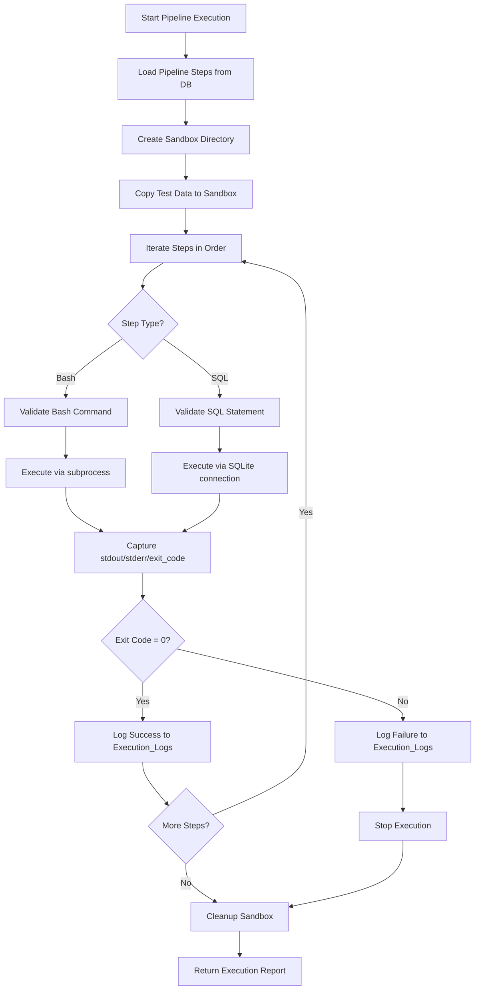
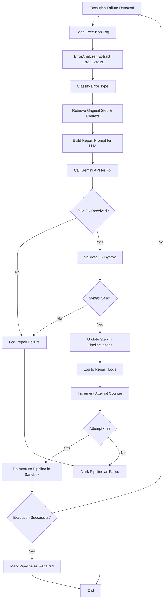
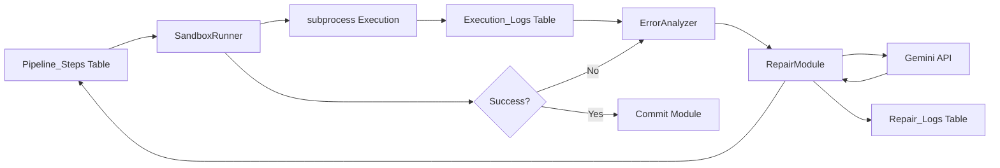

# Phase 4 & 5 Development Design

## Overview

This design document outlines the implementation strategy for Phase 4 (Sandbox Execution) and Phase 5 (Error Detection & Repair Loop) of the QueryForge automated data pipeline generation system.

## Phase 4: Sandbox Execution Module

### Purpose

Provide a secure, isolated execution environment for validating generated pipelines before production deployment. The sandbox must enforce safety constraints while capturing comprehensive execution metrics and logs.

### Core Components

#### 4.1 SandboxRunner Class

**Responsibilities:**
- Execute Bash and SQL scripts in isolated environment
- Enforce resource limits and security constraints
- Capture execution results and metrics
- Manage sandbox lifecycle and cleanup

**Key Methods:**

| Method | Input | Output | Purpose |
|--------|-------|--------|---------|
| execute_step | script_path, step_type | ExecutionResult | Execute single pipeline step |
| execute_pipeline | pipeline_id | PipelineExecutionReport | Execute complete pipeline sequentially |
| cleanup_sandbox | sandbox_id | boolean | Remove temporary files and reset state |
| validate_command | command_string | boolean | Check if command is whitelisted |

#### 4.2 Sandbox Environment Structure

**Directory Layout:**

```
sandbox/
├── {pipeline_id}/
│   ├── data/           # Copy of test data
│   ├── tmp/            # Temporary workspace
│   ├── scripts/        # Generated .sh and .sql files
│   └── logs/           # Execution output files
```

**Isolation Mechanisms:**

| Constraint Type | Implementation | Enforcement Point |
|----------------|----------------|-------------------|
| Filesystem Access | Restrict to sandbox/{pipeline_id} only | Pre-execution validation |
| Command Whitelist | Allow: awk, sed, cp, mv, curl, cat, grep | Command parsing |
| Timeout | 10 seconds per step | subprocess timeout parameter |
| Memory Limit | Best effort via system limits | Process spawning |
| Network Access | Block outbound connections | Environment variables |

#### 4.3 Execution Flow

**Sequential Step Execution:**



#### 4.4 ExecutionResult Data Structure

**Fields Captured per Step:**

| Field | Data Type | Description |
|-------|-----------|-------------|
| step_id | integer | Reference to Pipeline_Steps.id |
| pipeline_id | integer | Reference to Pipelines.id |
| run_time | timestamp | Execution start time |
| is_successful | boolean | True if exit_code = 0 |
| stdout | text | Standard output content |
| stderr | text | Error output content |
| exit_code | integer | Process exit code |
| execution_time_ms | integer | Duration in milliseconds |

#### 4.5 Command Whitelist Validation

**Allowed Commands:**

- File manipulation: awk, sed, cp, mv, cat, grep, head, tail, cut, sort, uniq
- Data transfer: curl (with URL validation)
- Utilities: wc, echo, date

**Blocked Commands:**

- Destructive: rm, dd, mkfs, format
- Privilege escalation: sudo, su, chmod, chown
- Network: wget, nc, telnet, ssh
- System: reboot, shutdown, kill

**Validation Logic:**

The system will extract the base command from the script and match against whitelist before execution. Any command not explicitly allowed will trigger immediate failure.

#### 4.6 SQL Execution Safety

**Constraints:**

| Operation | Allowed | Validation Rule |
|-----------|---------|-----------------|
| SELECT | Yes | Always allowed |
| INSERT | Yes | Must specify target table |
| UPDATE | Conditional | Must include WHERE clause |
| DELETE | Conditional | Must include WHERE clause |
| CREATE TABLE | Yes | Only IF NOT EXISTS |
| DROP TABLE | No | Blocked in sandbox |
| TRUNCATE | No | Blocked in sandbox |

**Execution Method:**

SQL steps execute against a sandbox copy of the database. Changes do not affect production until commit phase.

#### 4.7 Logging to Execution_Logs Table

**Database Insert per Step:**

After each step execution, the system will insert a record into Execution_Logs with the following mapping:

- pipeline_id: current pipeline identifier
- step_id: current step identifier
- run_time: timestamp at execution start
- is_successful: derived from exit_code (0 = true, non-zero = false)
- stdout: captured standard output
- stderr: captured error output
- exit_code: process exit code
- execution_time_ms: calculated duration

**Failure Handling:**

If logging fails, the system will retry once. If both attempts fail, the error will be logged to application logs but execution will continue.

---

## Phase 5: Error Detection & Repair Loop

### Purpose

Automatically detect, analyze, and repair pipeline execution failures using LLM-based error analysis, enabling self-healing capabilities without manual intervention.

### Core Components

#### 5.1 ErrorAnalyzer Class

**Responsibilities:**
- Parse execution logs to identify failure points
- Extract error messages and context
- Classify error types for targeted repair strategies

**Key Methods:**

| Method | Input | Output | Purpose |
|--------|-------|--------|---------|
| analyze_execution_failure | execution_log_id | ErrorReport | Extract error details from log |
| classify_error_type | error_message | ErrorCategory | Categorize error for repair strategy |
| extract_relevant_context | pipeline_id, step_id | ContextSnapshot | Gather context for repair |

#### 5.2 Error Classification

**Error Categories:**

| Category | Indicators | Typical Cause | Repair Strategy |
|----------|-----------|---------------|-----------------|
| FileNotFound | "No such file", "cannot open" | Incorrect path or missing file | Verify file existence, suggest correct path |
| TableMissing | "table does not exist" | Missing database table | Add CREATE TABLE step |
| SyntaxError | "syntax error", "unexpected token" | Invalid Bash/SQL syntax | Regenerate step with correct syntax |
| PermissionDenied | "permission denied" | File access restrictions | Adjust file paths to sandbox |
| Timeout | "execution timeout" | Step exceeds 10 seconds | Optimize command or split step |
| DataValidation | "constraint violation", "null value" | Data integrity issues | Add data cleaning step |

#### 5.3 RepairModule Class

**Responsibilities:**
- Generate corrected pipeline steps using LLM
- Validate proposed fixes before application
- Track repair attempts to prevent infinite loops

**Key Methods:**

| Method | Input | Output | Purpose |
|--------|-------|--------|---------|
| generate_fix | error_report, original_step, context | RepairedStep | Create corrected step using LLM |
| validate_fix | repaired_step | boolean | Verify fix is valid |
| apply_fix | pipeline_id, step_id, new_content | boolean | Update step in database |

#### 5.4 Repair Loop Workflow



#### 5.5 LLM Repair Prompt Structure

**Prompt Components:**

| Section | Content | Purpose |
|---------|---------|---------|
| System Context | Database schema, file list, constraints | Provide environmental awareness |
| Error Details | Failed step content, error message, exit code | Explain what went wrong |
| Execution History | Previous steps that succeeded | Show progress and dependencies |
| Repair Instructions | Expected output format, validation rules | Guide LLM response |

**Example Prompt Template:**

```
You are a pipeline repair assistant. A pipeline step has failed.

CONTEXT:
- Available tables: {table_list}
- Available files: {file_list}
- Allowed bash commands: {whitelist}

FAILED STEP:
- Type: {step_type}
- Content: {script_content}
- Error: {stderr}
- Exit Code: {exit_code}

PREVIOUS SUCCESSFUL STEPS:
{completed_steps}

TASK:
Generate a corrected version of the failed step that addresses the error.
Return ONLY valid {step_type} code without explanation.
```

#### 5.6 Repair Attempt Tracking

**Repair_Logs Table Entry per Attempt:**

| Field | Value Source | Purpose |
|-------|--------------|---------|
| pipeline_id | Current pipeline | Link to parent pipeline |
| attempt_number | Counter (1-3) | Track retry count |
| original_error | stderr from Execution_Logs | Record what failed |
| ai_fix_reason | LLM explanation field | Document repair rationale |
| patched_code | LLM generated fix | Store corrected step |
| repair_time | Current timestamp | Track when repair occurred |
| repair_successful | Post-retry execution result | Did fix work? |

#### 5.7 Infinite Loop Prevention

**Safeguards:**

| Mechanism | Implementation | Trigger Point |
|-----------|----------------|---------------|
| Maximum Attempts | Hard limit of 3 repairs per pipeline | Before each repair attempt |
| Duplicate Fix Detection | Hash and compare patched_code | Before applying fix |
| Timeout Enforcement | Abort if repair cycle exceeds 5 minutes | Background timer |
| Status Tracking | Update Pipelines.status to 'failed' | After 3rd attempt fails |

**Duplicate Fix Logic:**

If the LLM generates identical code to a previous repair attempt, the system will:
1. Log the duplicate detection
2. Skip re-execution
3. Increment attempt counter
4. Request alternative fix with modified prompt

#### 5.8 Integration Between Error Detection & Repair

**Trigger Points:**

| Event | Action | Next Step |
|-------|--------|-----------|
| Sandbox execution fails | ErrorAnalyzer.analyze_execution_failure() | Generate error report |
| Error report created | RepairModule.generate_fix() | Get LLM fix |
| Fix generated | RepairModule.apply_fix() | Update database |
| Fix applied | SandboxRunner.execute_pipeline() | Retry execution |
| Retry succeeds | Update Pipelines.status = 'repaired' | Proceed to commit |
| Retry fails | Check attempt count | Repeat or abort |

#### 5.9 Success Metrics

**Target Performance:**

| Metric | Target | Measurement Method |
|--------|--------|-------------------|
| Repair Success Rate | > 70% | (successful_repairs / total_attempts) × 100 |
| Average Repair Time | < 30 seconds | Time between failure detection and fix application |
| First Attempt Success | > 50% | Fixes that work on attempt #1 |
| Loop Prevention | 100% | No pipeline exceeds 3 attempts |

### Testing Strategy

#### Phase 4 Tests

**Unit Tests:**
- Command whitelist validation with allowed and blocked commands
- Timeout enforcement with long-running scripts
- Execution log database insertion
- Sandbox directory creation and cleanup

**Integration Tests:**
- Complete pipeline execution with multi-step scenarios
- Failure detection at various steps
- SQL and Bash script execution
- Resource limit enforcement

**Test Scenarios:**

| Scenario | Expected Behavior |
|----------|-------------------|
| Simple CSV import | All steps succeed, logs saved |
| Blocked command (rm) | Execution stops, error logged |
| Step timeout | Killed after 10s, timeout logged |
| SQL syntax error | Execution fails, stderr captured |
| Missing file reference | Step fails with clear error |

#### Phase 5 Tests

**Unit Tests:**
- Error classification accuracy
- LLM prompt generation
- Duplicate fix detection
- Attempt counter enforcement

**Integration Tests:**
- End-to-end repair loop with real failures
- Multi-attempt scenarios
- Successful repair followed by commit
- Maximum attempt limit enforcement

**Test Scenarios:**

| Scenario | Expected Behavior |
|----------|-------------------|
| Table missing error | LLM adds CREATE TABLE, retry succeeds |
| File path typo | LLM corrects path, retry succeeds |
| Syntax error in awk | LLM fixes syntax, retry succeeds |
| Unfixable error | 3 attempts fail, pipeline marked failed |
| Duplicate fix | Detected and skipped, alternative requested |

### Configuration Parameters

**Environment Variables:**

| Variable | Default | Description |
|----------|---------|-------------|
| SANDBOX_BASE_PATH | ./sandbox | Root directory for sandboxes |
| STEP_TIMEOUT_SECONDS | 10 | Maximum execution time per step |
| MAX_REPAIR_ATTEMPTS | 3 | Repair retry limit |
| REPAIR_TIMEOUT_MINUTES | 5 | Total repair cycle timeout |
| COMMAND_WHITELIST | awk,sed,cp,mv,curl | Allowed bash commands |

### Error Handling

**Phase 4 Error Scenarios:**

| Error | Response | Recovery |
|-------|----------|----------|
| Sandbox creation fails | Log error, return failure status | Retry once with temp directory |
| Logging to DB fails | Log to application logs | Continue execution |
| Timeout during execution | Kill process, log timeout | Mark step as failed |
| Invalid script file | Skip execution, log error | Return validation failure |

**Phase 5 Error Scenarios:**

| Error | Response | Recovery |
|-------|----------|----------|
| LLM API failure | Retry with exponential backoff | Fall back to manual intervention |
| Invalid fix syntax | Reject fix, log validation error | Increment attempt, retry |
| Database update fails | Rollback transaction | Retry update once |
| Max attempts reached | Mark pipeline failed | Notify for manual review |

### Dependencies

**Phase 4 Dependencies:**
- Phase 3 (Synthesizer) must be complete to provide script files
- Database tables (Pipelines, Pipeline_Steps, Execution_Logs) must exist
- SQLite connection configured
- subprocess module available

**Phase 5 Dependencies:**
- Phase 4 (Sandbox) must be complete for execution retry
- Phase 2 (LLM Generator) infrastructure for API calls
- Database tables (Repair_Logs) must exist
- Gemini API credentials configured

### Database Schema Usage

**Execution_Logs Inserts:**

For each executed step, insert one record with all captured metrics. Use database transaction to ensure log integrity.

**Repair_Logs Inserts:**

For each repair attempt, insert one record before retry. Update repair_successful field after retry execution completes.

**Pipelines Status Updates:**

| Transition | Trigger | New Status |
|-----------|---------|------------|
| Execution starts | SandboxRunner.execute_pipeline() | 'running' |
| Execution succeeds | All steps exit_code = 0 | 'success' |
| Execution fails | Any step exit_code ≠ 0 | 'failed' |
| Repair succeeds | Retry execution successful | 'repaired' |
| Max attempts | 3 repairs failed | 'failed' |

### Module Interaction Diagram



### Implementation Checklist

**Phase 4:**
- [ ] Create SandboxRunner class with execute_step method
- [ ] Implement command whitelist validation
- [ ] Add timeout enforcement via subprocess
- [ ] Build sandbox directory structure management
- [ ] Implement SQL execution via SQLite connection
- [ ] Add logging to Execution_Logs table
- [ ] Create cleanup mechanism for sandbox directories
- [ ] Write unit tests for all components
- [ ] Write integration tests for pipeline execution

**Phase 5:**
- [ ] Create ErrorAnalyzer class with classification logic
- [ ] Implement error parsing from Execution_Logs
- [ ] Create RepairModule class with LLM integration
- [ ] Build repair prompt template
- [ ] Implement attempt counter and loop prevention
- [ ] Add logging to Repair_Logs table
- [ ] Implement duplicate fix detection
- [ ] Create retry orchestration logic
- [ ] Write unit tests for error analysis
- [ ] Write integration tests for repair loop
    I -->|Yes| J[Commit Module]
```

### Implementation Checklist

**Phase 4:**
- [ ] Create SandboxRunner class with execute_step method
- [ ] Implement command whitelist validation
- [ ] Add timeout enforcement via subprocess
- [ ] Build sandbox directory structure management
- [ ] Implement SQL execution via SQLite connection
- [ ] Add logging to Execution_Logs table
- [ ] Create cleanup mechanism for sandbox directories
- [ ] Write unit tests for all components
- [ ] Write integration tests for pipeline execution

**Phase 5:**
- [ ] Create ErrorAnalyzer class with classification logic
- [ ] Implement error parsing from Execution_Logs
- [ ] Create RepairModule class with LLM integration
- [ ] Build repair prompt template
- [ ] Implement attempt counter and loop prevention
- [ ] Add logging to Repair_Logs table
- [ ] Implement duplicate fix detection
- [ ] Create retry orchestration logic
- [ ] Write unit tests for error analysis
- [ ] Write integration tests for repair loop
    I -->|No| E
